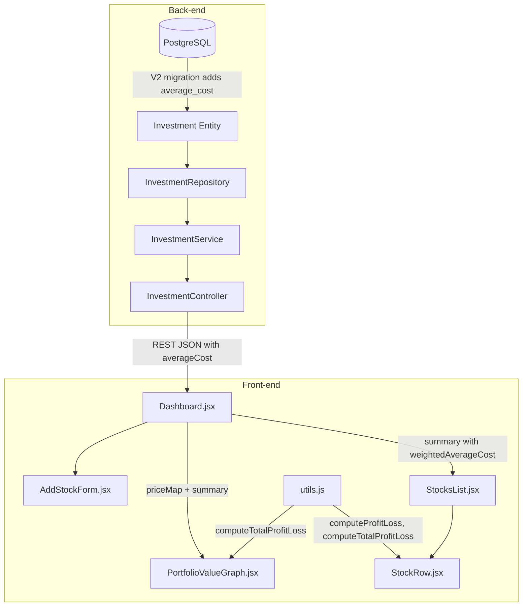

# Design Document: Average Cost & Profit/Loss

## Overview

This feature adds average cost (cost basis per share) tracking to the investment entity and enables profit/loss display across the application. The back-end stores an optional `averageCost` field per holding and exposes it through all existing API responses, including a weighted-average computation in the portfolio summary. The front-end gains toggle controls on both the StocksList and PortfolioValueGraph components to switch between "Total Value" and "Profit/Loss" display modes.

The profit/loss formula is: `(currentPrice - averageCost) × quantity` per holding.

Key design decisions:
- **Average cost is nullable** — users may not know their cost basis for all holdings.
- **Computation stays client-side** — the back-end provides averageCost and the front-end computes P/L using real-time prices from the WebSocket feed.
- **Weighted average in summary** — the `/api/investments/summary` endpoint computes a weighted average cost per symbol so the portfolio-level view can also show P/L.
- **Toggle state is component-local** — no persistence needed; defaults to "Total Value" on load.

## Architecture



### Data flow for P/L computation

1. Back-end returns `averageCost` per holding and `weightedAverageCost` per symbol in summary.
2. Dashboard stores summary (including weightedAverageCost) in state.
3. On each WebSocket price update, Dashboard passes priceMap + summary to both StocksList and PortfolioValueGraph.
4. Each component checks its local `displayMode` state and calls the appropriate computation from `utils.js`.

## Components and Interfaces

### Back-end Changes

#### 1. Flyway Migration — `V2__add_average_cost.sql`

```sql
ALTER TABLE investments
    ADD COLUMN average_cost DECIMAL(18, 8);
```

Nullable column, no default — existing rows get `NULL`.

#### 2. Investment Entity — new field

```java
@Column(name = "average_cost", precision = 18, scale = 8)
private BigDecimal averageCost;
```

With getter/setter. No `nullable = false` — the column is intentionally optional.

#### 3. InvestmentRequest — new optional field with validation

```java
@DecimalMin(value = "0.0", inclusive = true, message = "averageCost must be zero or greater")
@Digits(integer = 18, fraction = 8, message = "averageCost must have at most 18 integer digits and 8 decimal places")
private BigDecimal averageCost;
```

The field is optional (no `@NotNull`). The `@DecimalMin` constraint only fires when the value is non-null, rejecting negative values. The existing partial-update pattern (PUT without `@Valid`) allows explicit `null` to clear the field.

#### 4. InvestmentResponse — new field

```java
public record InvestmentResponse(
    Long id,
    String symbol,
    BigDecimal quantity,
    String platform,
    BigDecimal averageCost,
    OffsetDateTime createdAt
) {
    public static InvestmentResponse from(Investment investment) {
        return new InvestmentResponse(
            investment.getId(),
            investment.getSymbol(),
            investment.getQuantity(),
            investment.getPlatform(),
            investment.getAverageCost(),
            investment.getCreatedAt()
        );
    }
}
```

#### 5. HoldingDetailResponse — new field

```java
public record HoldingDetailResponse(
    Long id,
    BigDecimal quantity,
    String platform,
    BigDecimal averageCost,
    OffsetDateTime createdAt
) {
    public static HoldingDetailResponse from(Investment investment) {
        return new HoldingDetailResponse(
            investment.getId(),
            investment.getQuantity(),
            investment.getPlatform(),
            investment.getAverageCost(),
            investment.getCreatedAt()
        );
    }
}
```

#### 6. PortfolioSummaryResponse — new field

```java
public record PortfolioSummaryResponse(
    String symbol,
    BigDecimal totalQuantity,
    long holdingCount,
    BigDecimal weightedAverageCost
) {}
```

`weightedAverageCost` is `null` when all holdings for a symbol have null averageCost or zero combined quantity.

#### 7. InvestmentService — weighted average cost computation

The `getPortfolioSummary()` method changes from a single aggregate query to a two-step approach:

1. Keep the existing `findPortfolioSummary()` query for symbol/totalQuantity/holdingCount.
2. Add a new repository method or compute in-service: for each symbol, calculate `SUM(average_cost * quantity) / SUM(quantity)` across holdings where `average_cost IS NOT NULL`, rounded to 8 decimal places using `RoundingMode.HALF_UP`.

**Design decision**: Compute weighted average in Java rather than JPQL because:
- The formula needs conditional exclusion of null-averageCost rows.
- Division-by-zero guard is cleaner in Java.
- It keeps the repository layer simple.

Implementation approach:
```java
public List<PortfolioSummaryResponse> getPortfolioSummary() {
    List<Investment> all = investmentRepository.findAll();
    Map<String, List<Investment>> bySymbol = all.stream()
        .collect(Collectors.groupingBy(Investment::getSymbol));

    return bySymbol.entrySet().stream()
        .sorted(Map.Entry.comparingByKey())
        .map(entry -> {
            String symbol = entry.getKey();
            List<Investment> holdings = entry.getValue();
            BigDecimal totalQty = holdings.stream()
                .map(Investment::getQuantity)
                .reduce(BigDecimal.ZERO, BigDecimal::add);
            BigDecimal weightedAvgCost = computeWeightedAverageCost(holdings);
            return new PortfolioSummaryResponse(symbol, totalQty, holdings.size(), weightedAvgCost);
        })
        .toList();
}

private BigDecimal computeWeightedAverageCost(List<Investment> holdings) {
    BigDecimal numerator = BigDecimal.ZERO;
    BigDecimal denominator = BigDecimal.ZERO;
    for (Investment h : holdings) {
        if (h.getAverageCost() != null) {
            numerator = numerator.add(h.getAverageCost().multiply(h.getQuantity()));
            denominator = denominator.add(h.getQuantity());
        }
    }
    if (denominator.compareTo(BigDecimal.ZERO) == 0) {
        return null;
    }
    return numerator.divide(denominator, 8, RoundingMode.HALF_UP);
}
```

#### 8. InvestmentService.createInvestment / updateInvestment

- `createInvestment`: maps `request.getAverageCost()` → `investment.setAverageCost(...)`.
- `updateInvestment`: applies `request.getAverageCost()` the same way as other nullable fields. Since `@Valid` is not used on PUT, a request with `"averageCost": null` sets the field to null (clears cost basis).

**Important**: For PUT partial updates, we need to distinguish "field not sent" from "field sent as null". Current pattern uses `if (field != null) update`, which means you can't clear a field. To support explicit null for averageCost, we use a sentinel approach: the existing PUT controller does not use `@Valid`, so all fields come through. We'll update the service to always apply `averageCost` from the request (whether null or non-null) when the request body includes the key. Since Jackson deserializes missing keys as `null` and present-null as `null`, we'll add a boolean flag `averageCostProvided` using a custom setter or `@JsonSetter` annotation on the request DTO:

```java
private BigDecimal averageCost;
private boolean averageCostProvided = false;

@JsonSetter("averageCost")
public void setAverageCost(BigDecimal averageCost) {
    this.averageCost = averageCost;
    this.averageCostProvided = true;
}

@JsonIgnore
public boolean isAverageCostProvided() {
    return averageCostProvided;
}
```

In the service update method:
```java
if (request.isAverageCostProvided()) {
    existing.setAverageCost(request.getAverageCost());
}
```

### Front-end Changes

#### 1. `utils.js` — new computation functions

```javascript
/**
 * Computes profit/loss for a single holding.
 * Returns null if averageCost or price is unavailable.
 */
export function computeProfitLoss(quantity, currentPrice, averageCost) {
  if (currentPrice == null || averageCost == null) return null;
  return (currentPrice - averageCost) * quantity;
}

/**
 * Computes total portfolio profit/loss across all holdings.
 * Excludes holdings where weightedAverageCost or price is null.
 */
export function computeTotalProfitLoss(summary, priceMap) {
  if (!summary || !priceMap) return 0;
  let total = 0;
  for (const item of summary) {
    const price = priceMap[item.symbol];
    if (price != null && item.weightedAverageCost != null) {
      total += (price - item.weightedAverageCost) * item.totalQuantity;
    }
  }
  return total;
}
```

#### 2. `StocksList.jsx` — display mode toggle

Add a local `displayMode` state (`'totalValue'` | `'profitLoss'`) defaulting to `'totalValue'`. Render a toggle control above the list. Pass `displayMode` and `weightedAverageCost` (from summary item) down to `StockRow`.

#### 3. `StockRow.jsx` — conditional rendering

Accept new props: `displayMode`, `weightedAverageCost`.

- In `'totalValue'` mode: display as today (quantity × price).
- In `'profitLoss'` mode:
  - If `weightedAverageCost` is null → display "—".
  - Otherwise compute `(price - weightedAverageCost) × totalQuantity`.
  - Positive → green text, negative → red text, zero → default color.

#### 4. `PortfolioValueGraph.jsx` — display mode toggle + Y-axis label

Add a local `displayMode` state. When toggled:
- Clear existing `dataPoints` (parent resets via a callback or local state).
- In `'totalValue'` mode: plot `computeTotalValue(summary, priceMap)`.
- In `'profitLoss'` mode: plot `computeTotalProfitLoss(summary, priceMap)`.
- Change Y-axis label to `"Profit/Loss ($)"` when in profitLoss mode.
- Max 50 data points (per requirement 4.8).

**Design decision**: The toggle and data points are managed together. When the user switches mode, we clear the buffer and start fresh. This avoids mixing dollar-value data points with P/L data points on the same chart.

The `Dashboard.jsx` component will be updated to pass `displayMode` down and handle the data point computation centrally, since it already owns the WebSocket message handler and dataPoints state.

#### 5. `AddStockForm.jsx` — averageCost input field

Add an optional "Average Cost" field:
- `type="text"` with `inputMode="decimal"` for better mobile keyboard.
- Client-side validation: numeric only, ≤ 8 decimal places, ≤ 999999999.99999999, must be > 0 if provided.
- Submitted as part of the POST/PUT body: `averageCost: Number(value) || null`.

#### 6. Toggle Component — `DisplayModeToggle.jsx`

A reusable component:

```jsx
export default function DisplayModeToggle({ mode, onChange }) {
  return (
    <div className="display-mode-toggle" role="radiogroup" aria-label="Display mode">
      <button
        role="radio"
        aria-checked={mode === 'totalValue'}
        className={`display-mode-toggle__btn ${mode === 'totalValue' ? 'display-mode-toggle__btn--active' : ''}`}
        onClick={() => onChange('totalValue')}
      >
        Total Value
      </button>
      <button
        role="radio"
        aria-checked={mode === 'profitLoss'}
        className={`display-mode-toggle__btn ${mode === 'profitLoss' ? 'display-mode-toggle__btn--active' : ''}`}
        onClick={() => onChange('profitLoss')}
      >
        Profit/Loss
      </button>
    </div>
  );
}
```

Accessible via `role="radiogroup"` and `aria-checked` attributes.

## Data Models

### Database Schema Change

```sql
-- V2__add_average_cost.sql
ALTER TABLE investments
    ADD COLUMN average_cost DECIMAL(18, 8);
```

### Entity Field

| Field        | Type           | Nullable | Constraint                              |
|-------------|----------------|----------|-----------------------------------------|
| average_cost | DECIMAL(18,8) | Yes      | >= 0 when provided (enforced via Bean Validation) |

### API Request Body (create/update)

```json
{
  "symbol": "AAPL",
  "quantity": 10.5,
  "platform": "Robinhood",
  "averageCost": 142.50
}
```

`averageCost` is optional. Omitting it on create stores null. Sending `"averageCost": null` on update clears it.

### API Response Bodies

**InvestmentResponse** (individual holding):
```json
{
  "id": 1,
  "symbol": "AAPL",
  "quantity": 10.5,
  "platform": "Robinhood",
  "averageCost": 142.50000000,
  "createdAt": "2024-01-15T10:30:00Z"
}
```

**PortfolioSummaryResponse** (aggregated by symbol):
```json
{
  "symbol": "AAPL",
  "totalQuantity": 25.5,
  "holdingCount": 3,
  "weightedAverageCost": 148.23456789
}
```

**HoldingDetailResponse** (per-symbol breakdown):
```json
{
  "id": 1,
  "quantity": 10.5,
  "platform": "Robinhood",
  "averageCost": 142.50000000,
  "createdAt": "2024-01-15T10:30:00Z"
}
```

### Front-end State Shape

```javascript
// summary array item (from /api/investments/summary)
{
  symbol: "AAPL",
  totalQuantity: 25.5,
  holdingCount: 3,
  weightedAverageCost: 148.23456789  // null if no cost basis
}

// Display mode (local state in StocksList and PortfolioValueGraph)
displayMode: 'totalValue' | 'profitLoss'
```


## Correctness Properties

*A property is a characteristic or behavior that should hold true across all valid executions of a system—essentially, a formal statement about what the system should do. Properties serve as the bridge between human-readable specifications and machine-verifiable correctness guarantees.*

### Property 1: Average cost round-trip persistence

*For any* valid averageCost value (a non-negative BigDecimal with at most 18 integer digits and 8 fractional digits), creating an investment with that averageCost and then reading it back via the API SHALL return the same averageCost value.

**Validates: Requirements 1.3, 1.4, 2.1**

### Property 2: Negative averageCost rejection

*For any* negative BigDecimal value, attempting to create an investment with that value as averageCost SHALL result in a validation error response (HTTP 400).

**Validates: Requirements 1.6**

### Property 3: Weighted average cost computation

*For any* list of holdings for a symbol where each holding has a quantity (> 0) and an optional averageCost (nullable, non-negative), the computed weighted average cost SHALL equal `SUM(averageCost_i × quantity_i) / SUM(quantity_i)` considering only holdings where averageCost is non-null, rounded to 8 decimal places using half-up rounding. If no holdings have a non-null averageCost, or if the sum of their quantities is zero, the result SHALL be null.

**Validates: Requirements 2.2, 2.3, 2.4, 2.5**

### Property 4: Per-holding profit/loss formula

*For any* holding with a non-null averageCost and a non-null currentPrice, `computeProfitLoss(quantity, currentPrice, averageCost)` SHALL equal `(currentPrice - averageCost) × quantity`. If either averageCost or currentPrice is null, the function SHALL return null.

**Validates: Requirements 3.3, 5.1**

### Property 5: Total portfolio profit/loss sum

*For any* portfolio summary (list of symbols with totalQuantity and weightedAverageCost) and any priceMap (symbol → price), `computeTotalProfitLoss(summary, priceMap)` SHALL equal the sum of `(price - weightedAverageCost) × totalQuantity` for all symbols where both price and weightedAverageCost are non-null, and SHALL return 0 when no symbols satisfy that condition.

**Validates: Requirements 4.3, 5.2**

### Property 6: Data point buffer size invariant

*For any* sequence of data point additions to the portfolio graph buffer (starting from an empty buffer), the buffer length SHALL never exceed 50, and when an addition would cause the buffer to exceed 50, the oldest point SHALL be removed.

**Validates: Requirements 4.8**

### Property 7: Currency formatting precision

*For any* finite number, `formatCurrency(value)` SHALL produce a string with exactly 2 decimal places (no more, no less) and a leading `$` sign.

**Validates: Requirements 5.3**

### Property 8: Front-end validation rejects excess decimal places

*For any* numeric string representing a positive number with more than 8 digits after the decimal separator, the averageCost validation function SHALL return an error indicating the maximum allowed decimal places.

**Validates: Requirements 6.2**

### Property 9: Front-end validation rejects non-positive values

*For any* numeric value that is zero or negative, the averageCost validation function SHALL return an error indicating the value must be greater than zero.

**Validates: Requirements 6.4**

### Property 10: Front-end validation rejects non-numeric input

*For any* string that cannot be parsed as a valid finite number (e.g., contains letters, multiple decimals, or special characters), the averageCost validation function SHALL return an error indicating the value must be a valid number.

**Validates: Requirements 6.6**

## Error Handling

### Back-end

| Scenario | HTTP Status | Response |
|----------|-------------|----------|
| averageCost is negative | 400 | `{"field": "averageCost", "message": "averageCost must be zero or greater"}` |
| averageCost exceeds precision | 400 | `{"field": "averageCost", "message": "averageCost must have at most 18 integer digits and 8 decimal places"}` |
| Investment not found on update | 404 | `{"message": "Investment not found with id: X"}` |
| Invalid JSON body | 400 | Standard Spring Boot validation error response |

These are handled by the existing `GlobalExceptionHandler`. The new `@DecimalMin` and `@Digits` annotations on `InvestmentRequest.averageCost` integrate with the existing validation infrastructure.

### Front-end

| Scenario | Behavior |
|----------|----------|
| averageCost > 999999999.99999999 | Inline error under the field, form submission blocked |
| averageCost has > 8 decimal places | Inline error under the field, form submission blocked |
| averageCost ≤ 0 | Inline error: "Average cost must be greater than zero" |
| averageCost non-numeric | Inline error: "Average cost must be a valid number" |
| Price unavailable (null in priceMap) | Show loading indicator "…" regardless of display mode |
| averageCost null in P/L mode | Show "—" dash character |
| API error on create/update | Display API error message above form fields (existing pattern) |

## Testing Strategy

### Property-Based Tests (jqwik — Java back-end)

The project already uses jqwik 1.9.1 with Spring integration. Each property test runs a minimum of 100 iterations.

| Property | Test Class | What It Generates |
|----------|-----------|-------------------|
| Property 1: Round-trip persistence | `AverageCostPersistenceProperties` | Random valid BigDecimals (0 to 10^18, 0–8 dp) |
| Property 2: Negative rejection | `AverageCostValidationProperties` | Random negative BigDecimals |
| Property 3: Weighted average | `WeightedAverageCostProperties` | Random lists of (quantity, averageCost?) tuples |

### Property-Based Tests (fast-check — JavaScript front-end)

Use [fast-check](https://github.com/dubzzz/fast-check) for front-end property tests. Install as dev dependency.

| Property | Test File | What It Generates |
|----------|-----------|-------------------|
| Property 4: Per-holding P/L | `utils.property.test.js` | Random (quantity, price, avgCost) tuples |
| Property 5: Total portfolio P/L | `utils.property.test.js` | Random summary arrays + priceMaps |
| Property 6: Buffer invariant | `utils.property.test.js` | Random sequences of data points |
| Property 7: Currency formatting | `utils.property.test.js` | Random finite numbers |
| Property 8: >8dp validation | `validation.property.test.js` | Random numeric strings with varying decimal places |
| Property 9: Non-positive validation | `validation.property.test.js` | Random non-positive numbers |
| Property 10: Non-numeric validation | `validation.property.test.js` | Random non-numeric strings |

### Unit Tests (example-based)

**Back-end (JUnit 5)**:
- Create investment without averageCost → stored as null
- Update to explicit null → field cleared
- Portfolio summary with all-null averageCost → weightedAverageCost is null
- Portfolio summary with zero-quantity non-null holdings → weightedAverageCost is null
- `averageCostProvided` flag correctly distinguishes missing vs explicit null

**Front-end (Vitest)**:
- StocksList renders toggle control with both options
- StocksList defaults to "Total Value" mode
- StockRow shows "—" when averageCost is null in P/L mode
- StockRow applies green class for positive P/L
- StockRow applies red class for negative P/L
- StockRow shows no color class for zero P/L
- PortfolioValueGraph clears data points on mode switch
- PortfolioValueGraph Y-axis label changes in P/L mode
- AddStockForm renders averageCost field as optional
- AddStockForm allows empty averageCost submission

### Integration Tests

- Full create → read → update → delete cycle with averageCost via REST API
- Portfolio summary endpoint with mixed null/non-null holdings
- WebSocket price update triggers correct P/L computation in Dashboard

### Test Configuration

- **jqwik**: Minimum 100 tries per property (configured via `@Property(tries = 100)`)
- **fast-check**: Minimum 100 runs per property (configured via `fc.assert(property, { numRuns: 100 })`)
- **Tag format**: `Feature: average-cost-profit-loss, Property {N}: {title}`
