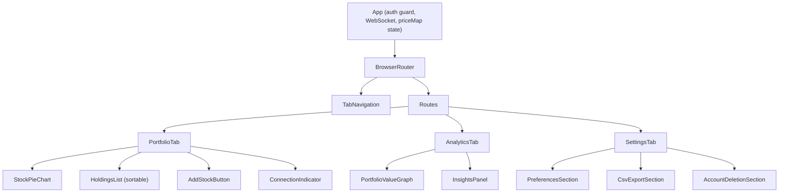

# Design Document: Dashboard Rework

## Overview

This design transforms the existing single-page Dashboard into a multi-tab layout using `react-router-dom` for client-side routing. The authenticated layout splits into three tabs — Portfolio, Analytics, and Settings — each accessible via its own URL path. The WebSocket connection and price state are lifted to the `App` component so all tabs share a single real-time data source.

On the back-end, two new endpoints are introduced:
- `POST /api/analytics/insights` — calls AWS Bedrock (Claude Haiku) to generate AI portfolio analysis.
- `DELETE /api/users/me` — permanently deletes the authenticated user and cascade-deletes holdings.

The front-end gains three new capabilities: column sorting (dropdown + arrow toggle), client-side CSV export, and account deletion with confirmation flow.

## Architecture

### Routing Structure

```
/portfolio   → PortfolioTab (default, redirect from / and unknown routes)
/analytics   → AnalyticsTab
/settings    → SettingsTab
```

`react-router-dom` v7 is added as a dependency. The `App` component wraps authenticated content in a `BrowserRouter` with a `Routes` block. A `Navigate` element handles the catch-all redirect to `/portfolio`.

### High-Level Component Tree



### WebSocket / Price State Sharing

Currently `useWebSocket` is called inside `Dashboard`. After the rework, it moves to `App` (or a shared context) so the `priceMap` is available to both Portfolio (for holdings list + pie chart) and Analytics (for the live graph). The `summary` data is also fetched at the `App` level and passed down.

```
App
├── useWebSocket(WS_URL) → priceMap, wsStatus
├── useApi().get('/investments/summary') → summary
├── TabNavigation (wsStatus for connection indicator)
├── <Route path="/portfolio">
│     <PortfolioTab summary={summary} priceMap={priceMap} ... />
├── <Route path="/analytics">
│     <AnalyticsTab summary={summary} priceMap={priceMap} ... />
└── <Route path="/settings">
      <SettingsTab summary={summary} priceMap={priceMap} ... />
```

This avoids reconnecting the WebSocket on tab switches and ensures price data is never lost during navigation.

## Components and Interfaces

### TabNavigation

Replaces the current `Nav` component within the authenticated layout.

```jsx
// Props
{ activeTab: string, onLogout: () => void, wsStatus: string }

// Renders
- Three NavLink elements: Portfolio, Analytics, Settings
- Sign Out button (calls onLogout)
- Connection indicator dot (from wsStatus)
```

Uses `NavLink` from react-router-dom for active-state styling.

### PortfolioTab

```jsx
// Props
{ summary, priceMap, onHoldingChanged }

// Contains
- StockPieChart (unchanged)
- HoldingsList (new sortable version)
- AddStockButton + AddStockForm (unchanged)
```

### HoldingsList (replaces StocksList)

```jsx
// Props
{ summary, priceMap, onHoldingChanged }

// Internal state
- sortField: 'symbol' | 'shares' | 'price' | 'profitLoss' | 'totalValue'
- sortDirection: 'asc' | 'desc'
- expandedSymbol: string | null

// Renders
- Sort controls: <select> dropdown + <button> arrow toggle (↑/↓)
- Column headers row
- Sorted StockRow list
```

#### Sort Data Flow

1. User selects a field from the `<select>` dropdown → `setSortField(field)`
2. User clicks the arrow button → `setSortDirection(d => d === 'asc' ? 'desc' : 'asc')`
3. A derived `sortedSummary` array is computed each render (React Compiler handles memoization):

```js
function sortHoldings(summary, priceMap, sortField, sortDirection) {
  const comparator = buildComparator(sortField, priceMap);
  const sorted = [...summary].sort(comparator);
  return sortDirection === 'desc' ? sorted.reverse() : sorted;
}
```

4. When `priceMap` updates (WebSocket tick), the component re-renders and the sorted order reflects the new values — preserving the user's chosen sort field and direction (Requirement 3.6).

#### Sort Field Value Extraction

| Sort Field   | Value Expression                                             |
|-------------|-------------------------------------------------------------|
| symbol      | `item.symbol` (string compare, case-insensitive)            |
| shares      | `item.totalQuantity`                                        |
| price       | `priceMap[item.symbol] ?? 0`                                |
| profitLoss  | `computeProfitLoss(item.totalQuantity, priceMap[item.symbol], item.weightedAverageCost) ?? 0` |
| totalValue  | `(item.totalQuantity) * (priceMap[item.symbol] ?? 0)`       |

### AnalyticsTab

```jsx
// Props
{ summary, priceMap }

// Internal state
- dataPoints: array (graph data, reset on mount)
- graphDisplayMode: 'totalValue' | 'profitLoss' (initialized from Preference_Store)
- insightsState: { data, loading, error, cooldownEnd }

// Behavior
- On mount (or re-mount after navigating away): atomically reset dataPoints and seed
  an initial point from current priceMap. If priceMap is empty, keep previous state.
- Subscribes to priceMap changes to append new data points.
```

### InsightsPanel

```jsx
// Props
{ summary, priceMap }

// Internal state
- response: { allocation, risk, suggestions } | null
- loading: boolean
- error: string | null
- cooldownEnd: number (timestamp)

// Behavior
- "Generate Insights" button triggers POST /api/analytics/insights
- On success: display structured sections
- On 429: read Retry-After header, set cooldownEnd, show countdown
- On error: show error message, re-enable button
```

### SettingsTab

```jsx
// Props
{ summary, priceMap, onLogout }

// Contains
- PreferencesSection: default view mode toggle (localStorage)
- CsvExportSection: "Export CSV" button
- AccountDeletionSection: "Delete Account" button + ConfirmationModal
```

### CsvExportSection

```jsx
// Simple button that opens the export URL in a new tab/triggers download

function handleExport() {
  const token = localStorage.getItem('access_token');
  window.open(`${API_BASE_URL}/investments/export?token=${token}`, '_blank');
}
```

The back-end handles all CSV generation. The endpoint returns `Content-Type: text/csv` with a `Content-Disposition: attachment; filename="holdings_export_YYYY-MM-DD.csv"` header.

### AccountDeletionSection

```jsx
// Internal state
- modalOpen: boolean
- deleting: boolean
- error: string | null

// Flow
1. Click "Delete Account" → open confirmation modal
2. Click "Confirm" → POST DELETE /api/users/me
3. On 204: clear tokens, clear localStorage, redirect to login
4. On error: show error, keep modal open
```

## Data Models

### Front-end State Shape

```js
// App-level state (lifted from Dashboard)
{
  summary: PortfolioSummaryItem[],  // from GET /investments/summary
  priceMap: { [symbol: string]: number },
  wsStatus: 'connected' | 'connecting' | 'reconnecting' | 'disconnected' | 'failed'
}

// PortfolioSummaryItem (matches backend PortfolioSummaryResponse)
{
  symbol: string,
  totalQuantity: number,
  holdingCount: number,
  weightedAverageCost: number | null
}
```

### Insights API

#### Request: `POST /api/analytics/insights`

Headers: `Authorization: Bearer <JWT>`

Body: None (server reads user's holdings from DB)

#### Response: 200 OK

```json
{
  "allocation": "string — allocation analysis text",
  "risk": "string — risk assessment text",
  "suggestions": "string — actionable suggestions text",
  "generatedAt": "2025-01-15T10:30:00Z"
}
```

#### Response: 429 Too Many Requests

```
Retry-After: 45
```

Body:
```json
{
  "message": "Rate limit exceeded",
  "retryAfterSeconds": 45
}
```

### Account Deletion API

#### Request: `DELETE /api/users/me`

Headers: `Authorization: Bearer <JWT>`

#### Response: 204 No Content

(User record + all holdings cascade-deleted)

#### Response: 500

```json
{
  "message": "Failed to delete account"
}
```

### Back-end: InsightsService

```java
@Service
public class InsightsService {
    private final BedrockRuntimeClient bedrockClient;
    private final HoldingService holdingService;
    private final Map<Long, Instant> cooldownMap; // userId → lastRequestTime

    public InsightsResponse generateInsights(User user) { ... }
    public boolean isOnCooldown(Long userId) { ... }
    public long getRemainingCooldownSeconds(Long userId) { ... }
}
```

### Back-end: UserService

```java
@Service
public class UserService {
    private final UserRepository userRepository;
    private final HoldingRepository holdingRepository;
    private final SubscriptionManager subscriptionManager;
    private final FinnhubClient finnhubClient;
    private final SessionRegistry sessionRegistry;

    @Transactional
    public void deleteUser(User user) { ... }
}
```

### AWS Bedrock Integration Design

**SDK**: `software.amazon.awssdk:bedrockruntime` (AWS SDK for Java v2)

**Model ID**: `anthropic.claude-3-haiku-20240307-v1:0` (configurable via `app.bedrock.model-id` property)

**Region**: Read from `app.bedrock.region` property (defaults to `us-east-1`)

**Invocation flow**:

1. `InsightsService.generateInsights(user)` fetches the user's portfolio summary.
2. Constructs a prompt with holdings context (symbols, quantities, weighted avg costs).
3. Calls `BedrockRuntimeClient.invokeModel()` with the Messages API format:

```java
String requestBody = """
{
  "anthropic_version": "bedrock-2023-05-31",
  "max_tokens": 1024,
  "messages": [
    {
      "role": "user",
      "content": "%s"
    }
  ],
  "system": "%s"
}
""".formatted(userPrompt, systemPrompt);

InvokeModelRequest request = InvokeModelRequest.builder()
    .modelId(modelId)
    .contentType("application/json")
    .accept("application/json")
    .body(SdkBytes.fromUtf8String(requestBody))
    .build();

InvokeModelResponse response = bedrockClient.invokeModel(request);
```

**System prompt** (stored in config):
```
You are a portfolio analyst. Given the user's holdings, provide a structured analysis with exactly three sections:
1. ALLOCATION: Analyze the portfolio's diversification and concentration.
2. RISK: Assess risk factors including sector concentration and volatility exposure.
3. SUGGESTIONS: Provide 2-3 actionable, general suggestions for portfolio improvement.
Keep each section concise (2-4 sentences). Do not provide specific buy/sell recommendations or price targets.
```

**User prompt** (constructed at runtime):
```
Analyze this portfolio:
- AAPL: 10 shares, avg cost $150.00
- BTC-USD: 0.5 shares, avg cost $45000.00
...
```

**Response parsing**: The Bedrock response JSON contains a `content[0].text` field. The service parses the text by looking for section headers (ALLOCATION:, RISK:, SUGGESTIONS:) and splits accordingly. If parsing fails, the full text is returned in the `allocation` field with `risk` and `suggestions` as empty strings.

**Error handling**: `BedrockRuntimeException` is caught and wrapped in a 502 Bad Gateway response. Timeout is set to 30 seconds via SDK client configuration.


## Correctness Properties

*A property is a characteristic or behavior that should hold true across all valid executions of a system — essentially, a formal statement about what the system should do. Properties serve as the bridge between human-readable specifications and machine-verifiable correctness guarantees.*

### Property 1: Valid tab navigation updates route

*For any* tab in the set {portfolio, analytics, settings}, clicking that tab should update the browser URL to `/{tab}` and render the corresponding tab content without a full page reload.

**Validates: Requirements 1.2**

### Property 2: Unknown routes redirect to portfolio

*For any* URL path that is not one of `/portfolio`, `/analytics`, or `/settings`, the router should redirect to `/portfolio`.

**Validates: Requirements 1.3**

### Property 3: Sort correctness

*For any* non-empty array of holdings, any valid sort field (symbol, shares, price, profitLoss, totalValue), and any direction (asc or desc), applying `sortHoldings` should return an array where consecutive elements are ordered according to the selected field's natural comparator in the specified direction.

**Validates: Requirements 3.3, 3.5**

### Property 4: Insights response renders all sections

*For any* valid InsightsResponse where allocation, risk, and suggestions are non-empty strings, the InsightsPanel should render three distinct sections each containing the corresponding text.

**Validates: Requirements 5.3**

### Property 5: Cooldown timer display

*For any* cooldownEnd timestamp in the future, the "Generate Insights" button should be disabled and display the remaining seconds (cooldownEnd - now) until it reaches zero.

**Validates: Requirements 5.6**

### Property 6: Display mode preference round-trip

*For any* valid display mode ('totalValue' or 'profitLoss') stored in localStorage, when the AnalyticsTab mounts, it should initialize `graphDisplayMode` to that stored value. If no value is stored, it should default to 'totalValue'.

**Validates: Requirements 6.3**

### Property 7: CSV generation produces correct structure

*For any* array of holdings with valid symbol, quantity, averageCost, currentPrice, platform, and computed profitLoss/totalValue fields, `generateCsv` should produce a CSV string where the first line contains the headers "Symbol,Shares,Average Cost,Current Price,Profit/Loss,Total Value,Platform" and each subsequent line contains the corresponding values for each holding.

**Validates: Requirements 7.2**

### Property 8: CSV filename matches date pattern

*For any* valid Date object, the exported filename should equal `holdings_export_YYYY-MM-DD.csv` where YYYY-MM-DD corresponds to the date's ISO date string.

**Validates: Requirements 7.3**

### Property 9: User deletion cascades to all holdings

*For any* user with N holdings (N ≥ 0), after `UserService.deleteUser(user)` completes, the holding count for that user should be 0 and the user record should no longer exist in the database.

**Validates: Requirements 8.4**

### Property 10: Rate limit returns correct Retry-After

*For any* elapsed time T (where 0 < T < 60 seconds) since a user's last successful insight request, calling `POST /api/analytics/insights` should return HTTP 429 with a `Retry-After` header value approximately equal to 60 - T (±1 second tolerance for timing).

**Validates: Requirements 9.1**

### Property 11: Per-user cooldown isolation

*For any* two distinct authenticated users A and B, user A being within their cooldown period should not prevent user B from successfully generating insights (and vice versa).

**Validates: Requirements 9.2**

## Error Handling

| Scenario | Layer | Behavior |
|----------|-------|----------|
| WebSocket disconnect | Front-end (App) | Show "reconnecting" indicator; exponential backoff up to 10 attempts; show "failed" if all attempts exhausted |
| GET /investments/summary fails | Front-end (App) | Show full-page error with retry button |
| POST /api/analytics/insights timeout (30s) | Back-end | Return 502 Bad Gateway with message "AI service timeout" |
| Bedrock invocation error | Back-end (InsightsService) | Catch `BedrockRuntimeException`, return 502 with generic message |
| POST /api/analytics/insights 429 | Front-end (InsightsPanel) | Read `Retry-After` header, disable button, show countdown |
| POST /api/analytics/insights 5xx | Front-end (InsightsPanel) | Display error message, re-enable button |
| DELETE /api/users/me failure | Front-end (AccountDeletionSection) | Display error in modal, keep modal open for retry |
| DELETE /api/users/me 401 | Front-end (useApi) | Trigger token refresh; if refresh fails, redirect to login |
| CSV export with empty holdings | Front-end (CsvExporter) | Generate CSV with headers only (no data rows) |
| Sort with missing price data | Front-end (HoldingsList) | Treat missing price as 0 for sort comparisons; display "…" in the cell |
| Graph reset with empty priceMap | Front-end (AnalyticsTab) | Do not reset — keep previous dataPoints state (atomic guarantee) |

## Testing Strategy

### Front-end Testing

**Framework**: Vitest + @testing-library/react + fast-check (already installed)

**Unit tests** (example-based):
- TabNavigation renders correctly with active state
- Sort dropdown options match specification
- Arrow toggle button reflects sort direction
- CSV export generates valid CSV for known inputs
- AccountDeletionSection modal open/close flow
- PreferencesSection writes to localStorage
- InsightsPanel loading/error/success states

**Property-based tests** (fast-check, minimum 100 iterations each):
- Property 1: Tab navigation routing (parameterized over tab set)
- Property 2: Unknown route redirect (random string paths)
- Property 3: Sort correctness (random holdings arrays, all fields, both directions)
- Property 5: Cooldown timer display (random future timestamps)
- Property 6: Display mode preference round-trip (both valid modes + missing key)
- Property 7: CSV generation structure (random holdings data)
- Property 8: CSV filename date format (random dates)

**Configuration**:
- Each property test runs with `{ numRuns: 100 }` minimum
- Each test is tagged with: `// Feature: dashboard-rework, Property N: <title>`

### Back-end Testing

**Framework**: JUnit 5 + jqwik (already configured) + Testcontainers for integration

**Unit tests** (example-based):
- `InsightsController` returns 200 with valid response
- `InsightsController` returns 429 when on cooldown
- `UserController` returns 204 on successful deletion
- `InsightsService` parses Bedrock response sections correctly
- Security config rejects unauthenticated requests to new endpoints

**Property-based tests** (jqwik, minimum 100 iterations):
- Property 4: Insights response parsing (random three-section text)
- Property 9: User deletion cascade (random user with random N holdings)
- Property 10: Rate limit Retry-After correctness (random elapsed times)
- Property 11: Per-user cooldown isolation (random user pairs)

**Integration tests** (Testcontainers + mocked Bedrock):
- Full flow: create user → create holdings → delete user → verify cascade
- Insights endpoint with mocked BedrockRuntimeClient
- Rate limit enforcement across multiple requests

**Configuration**:
- jqwik property tests use `@Property(tries = 100)` minimum
- Each test is tagged with: `// Feature: dashboard-rework, Property N: <title>`
