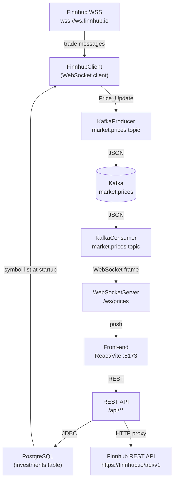

# Design Document: finnhub-websocket-api

## Overview

The back-end is a single Spring Boot 3 application that acts as the data hub for the Investment Tracker. It has three distinct responsibilities:

1. **Ingest** — maintain a persistent WebSocket connection to Finnhub (`wss://ws.finnhub.io`) and receive real-time trade events for the user's subscribed symbols.
2. **Distribute** — publish those trade events to a Kafka topic (`market.prices`) and consume them back to push price updates to any connected front-end clients over a WebSocket server at `/ws/prices`.
3. **Persist** — expose a REST API for symbol search (proxied to Finnhub) and full CRUD for the user's investment records, backed by a PostgreSQL database managed with Flyway.

The Kafka layer decouples ingestion from delivery: the Finnhub client thread never blocks on front-end delivery, and the consumer can be scaled or replaced independently.

This is a single-user personal tool, so there is no authentication layer, no multi-tenancy, and no horizontal scaling concern. The design prioritises simplicity and correctness over enterprise patterns.

---

## Architecture



**Key design decisions:**

- **Java-WebSocket (TooTallNate)** is used for the outbound Finnhub client. Spring's built-in `WebSocketClient` is reactive/WebFlux-oriented; the standalone `org.java-websocket:Java-WebSocket` library is simpler for a single persistent outbound connection and has no additional framework dependencies.
- **Spring WebSocket (JSR-356 / `@ServerEndpoint`)** is used for the inbound `/ws/prices` server. It integrates cleanly with embedded Tomcat and Spring's IoC container via `SpringConfigurator`.
- **Spring Kafka** (`spring-kafka`) handles producer and consumer configuration with `JsonSerializer` / `JsonDeserializer` for the `PriceUpdate` POJO.
- **Spring Data JPA + Hibernate** manages the `Investment` entity with PostgreSQL.
- **Flyway** runs schema migrations on startup before the application context finishes initialising.
- **Spring Boot Actuator** provides the `/actuator/health` endpoint with no extra code.

---

## Components and Interfaces

### Package Structure

```
com.investmenttracker/
├── InvestmentTrackerApplication.java   # @SpringBootApplication entry point
├── config/
│   ├── AppConfig.java                  # Environment variable validation, beans
│   ├── KafkaConfig.java                # Producer/consumer factory beans
│   ├── WebSocketServerConfig.java      # ServerEndpointExporter bean
│   └── CorsConfig.java                 # CORS configuration
├── finnhub/
│   ├── FinnhubClient.java              # Outbound WebSocket client (Java-WebSocket)
│   ├── FinnhubReconnectScheduler.java  # Exponential back-off reconnect logic
│   ├── dto/
│   │   ├── TradeMessage.java           # Finnhub inbound JSON DTO
│   │   └── TradeEvent.java             # Single trade event within TradeMessage
│   └── SubscriptionManager.java        # In-memory subscribed symbol set
├── kafka/
│   ├── PriceUpdateProducer.java        # Publishes PriceUpdate to market.prices
│   └── PriceUpdateConsumer.java        # Consumes market.prices, forwards to WS
├── websocket/
│   └── PriceWebSocketEndpoint.java     # @ServerEndpoint("/ws/prices")
├── investment/
│   ├── Investment.java                 # @Entity
│   ├── InvestmentRepository.java       # JpaRepository
│   ├── InvestmentService.java          # Business logic + symbol sync
│   └── InvestmentController.java       # @RestController /api/investments
├── symbol/
│   ├── SymbolSearchService.java        # Proxies Finnhub REST search
│   └── SymbolController.java           # @RestController /api/symbols/search
├── dto/
│   └── PriceUpdate.java                # Shared DTO: symbol, price, timestamp
└── exception/
    ├── GlobalExceptionHandler.java     # @ControllerAdvice
    └── ErrorResponse.java              # { message, correlationId }
```

### Component Responsibilities

#### `FinnhubClient`
- Extends `org.java_websocket.client.WebSocketClient`.
- Opened as a Spring `@Component` with `@PostConstruct` triggering `connectBlocking()`.
- `onMessage(String)` parses the raw JSON into `TradeMessage`, extracts the latest-price event per symbol, and delegates to `PriceUpdateProducer`.
- Exposes `subscribe(String symbol)` and `unsubscribe(String symbol)` methods called by `InvestmentService`.
- Delegates reconnect scheduling to `FinnhubReconnectScheduler` on `onClose`.

#### `FinnhubReconnectScheduler`
- Holds reconnect state: attempt count, current delay.
- Implements exponential back-off: delay starts at 1 s, doubles each attempt, caps at 60 s, stops after 10 attempts.
- On successful reconnect (`onOpen`), calls `SubscriptionManager.resubscribeAll()` and resets state.
- On auth failure (HTTP 401/403 during upgrade), logs ERROR and sets a `authFailed` flag that prevents further reconnect attempts.

#### `SubscriptionManager`
- Holds a `CopyOnWriteArraySet<String>` of currently subscribed symbols.
- `add(symbol)` / `remove(symbol)` / `getAll()` / `resubscribeAll()` methods.
- Populated at startup from the database via `InvestmentService`.

#### `PriceUpdateProducer`
- Wraps `KafkaTemplate<String, PriceUpdate>`.
- `publish(PriceUpdate)` sends to topic `market.prices` with the symbol as the Kafka key.
- On `KafkaProducerException`, logs the failure once (symbol + price) and returns — no retry.

#### `PriceUpdateConsumer`
- `@KafkaListener(topics = "market.prices")`.
- On each `PriceUpdate`, iterates `PriceWebSocketEndpoint.getSessions()` and sends a JSON text frame to each open session.
- On send failure for a specific session, removes that session (consistent with disconnect handling).
- On Kafka broker unavailability (detected via `KafkaListenerErrorHandler` or container lifecycle events), closes all sessions with close code 1011 and pauses the listener container.

#### `PriceWebSocketEndpoint`
- `@ServerEndpoint(value = "/ws/prices", configurator = SpringConfigurator.class)`.
- Maintains a static `CopyOnWriteArraySet<Session>` of active sessions.
- `@OnOpen` adds session; `@OnClose` / `@OnError` removes session.
- Exposes `static Set<Session> getSessions()` for the consumer to iterate.

#### `InvestmentService`
- `createInvestment(dto)` — persists, then calls `FinnhubClient.subscribe(symbol)` if symbol not already in `SubscriptionManager`.
- `deleteInvestment(id)` — deletes, then calls `FinnhubClient.unsubscribe(symbol)` if no other investment references that symbol.
- `updateInvestment(id, dto)` — handles symbol change: unsubscribe old if orphaned, subscribe new if not already tracked.
- `getPortfolioSummary()` — returns holdings aggregated by symbol (total quantity + holding count per symbol) for the front-end dashboard.
- `getHoldingsBySymbol(symbol)` — returns all holdings for a specific symbol, showing the per-platform breakdown for drill-down views.
- `initSubscriptions()` — called `@PostConstruct`, queries distinct symbols from DB, populates `SubscriptionManager`.

#### `SymbolSearchService`
- Uses `RestTemplate` (or `RestClient` in Spring Boot 3.2+) to call `https://finnhub.io/api/v1/search?q={query}&token={key}`.
- Enforces a 3-second timeout.
- Maps the Finnhub response to a list of up to 10 `SymbolResult` DTOs.
- Throws `UpstreamException` on 4xx/5xx or timeout, which `GlobalExceptionHandler` maps to HTTP 502.

#### `GlobalExceptionHandler`
- `@ControllerAdvice` with handlers for:
  - `MethodArgumentNotValidException` → 400 with per-field errors.
  - `EntityNotFoundException` → 404.
  - `UpstreamException` → 502.
  - `MissingServletRequestParameterException` → 400.
  - `Exception` (catch-all) → 500 with `{ message: "An unexpected error occurred", correlationId: <UUID> }`.
- Never exposes stack traces or exception class names in the response body.

---

## Data Models

### `Investment` Entity

```java
@Entity
@Table(name = "investments")
public class Investment {
    @Id
    @GeneratedValue(strategy = GenerationType.IDENTITY)
    private Long id;

    @Column(name = "symbol", nullable = false, length = 20)
    private String symbol;

    @Column(name = "quantity", nullable = false, precision = 18, scale = 8)
    private BigDecimal quantity;

    @Column(name = "platform", length = 100)
    private String platform;

    @Column(name = "created_at", nullable = false, updatable = false,
            columnDefinition = "TIMESTAMP WITH TIME ZONE")
    private OffsetDateTime createdAt;
}
```

### `PriceUpdate` DTO (Kafka message + WebSocket frame)

```java
public record PriceUpdate(
    String symbol,          // e.g. "AAPL"
    BigDecimal price,       // up to 8 decimal places
    String timestamp        // ISO-8601 UTC, e.g. "2024-01-15T14:30:00.123Z"
) {}
```

### Finnhub Inbound DTOs

Finnhub sends trade messages in this shape:
```json
{
  "type": "trade",
  "data": [
    { "s": "AAPL", "p": 182.34, "t": 1705329000123, "v": 100, "c": ["1"] }
  ]
}
```

```java
public record TradeMessage(String type, List<TradeEvent> data) {}
public record TradeEvent(String s, BigDecimal p, long t, BigDecimal v, List<String> c) {}
```

Subscription/unsubscription messages sent to Finnhub:
```json
{ "type": "subscribe",   "symbol": "AAPL" }
{ "type": "unsubscribe", "symbol": "AAPL" }
```

### Flyway Migration

`src/main/resources/db/migration/V1__create_investments.sql`:
```sql
CREATE TABLE investments (
    id          BIGSERIAL PRIMARY KEY,
    symbol      VARCHAR(20)              NOT NULL,
    quantity    DECIMAL(18, 8)           NOT NULL,
    platform    VARCHAR(100),
    created_at  TIMESTAMP WITH TIME ZONE NOT NULL DEFAULT NOW()
);
```

### REST API Shapes

**`GET /api/investments/summary` response (portfolio summary):**
```json
[
  { "symbol": "AAPL", "totalQuantity": 35.5, "holdingCount": 3 },
  { "symbol": "BINANCE:BTCUSDT", "totalQuantity": 1.25, "holdingCount": 2 }
]
```

**`GET /api/investments/symbol/AAPL` response (per-symbol platform breakdown):**
```json
[
  { "id": 1, "quantity": 10.5, "platform": "Robinhood", "createdAt": "2024-01-15T14:30:00Z" },
  { "id": 4, "quantity": 15.0, "platform": "401k", "createdAt": "2024-02-01T09:00:00Z" },
  { "id": 7, "quantity": 10.0, "platform": "Roth IRA", "createdAt": "2024-03-10T11:15:00Z" }
]
```

**`POST /api/investments` request body:**
```json
{ "symbol": "AAPL", "quantity": 10.5, "platform": "Robinhood" }
```

**Investment response:**
```json
{ "id": 1, "symbol": "AAPL", "quantity": 10.5, "platform": "Robinhood", "createdAt": "2024-01-15T14:30:00Z" }
```

**Error response:**
```json
{ "message": "Validation failed", "errors": { "symbol": "must not be blank" } }
```

**Unhandled error response:**
```json
{ "message": "An unexpected error occurred", "correlationId": "550e8400-e29b-41d4-a716-446655440000" }
```

### Environment Variables

| Variable | Default | Required |
|---|---|---|
| `FINNHUB_API_KEY` | — | Yes |
| `KAFKA_BOOTSTRAP_SERVERS` | `localhost:9092` | No |
| `DATABASE_URL` | — | Yes |
| `DATABASE_USERNAME` | — | Yes |
| `DATABASE_PASSWORD` | — | Yes |
| `FRONTEND_ORIGIN` | `http://localhost:5173` | No |
| `server.port` | `8080` | No |

### Maven Dependencies (key)

```xml
<!-- Spring Boot starters -->
<dependency>spring-boot-starter-web</dependency>
<dependency>spring-boot-starter-data-jpa</dependency>
<dependency>spring-boot-starter-actuator</dependency>
<dependency>spring-boot-starter-validation</dependency>
<dependency>spring-boot-starter-websocket</dependency>

<!-- Kafka -->
<dependency>spring-kafka</dependency>

<!-- Outbound WebSocket client -->
<dependency>org.java-websocket:Java-WebSocket:1.5.6</dependency>

<!-- Database -->
<dependency>org.postgresql:postgresql</dependency>
<dependency>org.flywaydb:flyway-core</dependency>
<dependency>org.flywaydb:flyway-database-postgresql</dependency>

<!-- JSON -->
<dependency>com.fasterxml.jackson.core:jackson-databind</dependency>
```

---

## Correctness Properties

*A property is a characteristic or behavior that should hold true across all valid executions of a system — essentially, a formal statement about what the system should do. Properties serve as the bridge between human-readable specifications and machine-verifiable correctness guarantees.*

### Property 1: Latest-price extraction selects the highest-timestamp event per symbol

*For any* `TradeMessage` containing one or more `TradeEvent` records for the same symbol, the `PriceUpdate` produced for that symbol SHALL have the `price` field equal to the `p` value of the `TradeEvent` with the greatest `t` (timestamp) value among all events for that symbol.

**Validates: Requirements 3.1**

---

### Property 2: PriceUpdate serialization round-trip

*For any* valid `PriceUpdate` (arbitrary symbol string, price with up to 8 decimal places, ISO-8601 UTC timestamp), serializing it to JSON and deserializing it back SHALL produce an object equal to the original.

**Validates: Requirements 3.2**

---

### Property 3: Investment validation rejects all invalid inputs

*For any* investment request body where `quantity` is outside the range `[0.000001, 999999999.99]`, or `symbol` exceeds 20 characters, or `platform` exceeds 100 characters, the REST API SHALL reject the request with HTTP 400 containing per-field error details, and SHALL NOT persist any record to the database.

**Validates: Requirements 7.2, 7.3, 7.6**

---

### Property 4: Subscription set invariant across create and delete operations

*For any* sequence of investment create and delete operations, the in-memory subscribed symbol set SHALL contain exactly the set of distinct symbols that have at least one investment record in the database — no more, no less.

**Validates: Requirements 5.1, 5.2, 5.3**

---

### Property 5: Symbol search result count is capped at 10

*For any* non-empty search query, regardless of how many results Finnhub returns (0 to N), the REST API response SHALL contain at most 10 results.

**Validates: Requirements 6.1**

---

### Property 6: Reconnect back-off delay follows exponential sequence

*For any* reconnect attempt number `n` in `[0, 9]`, the delay before that attempt SHALL equal `min(1 × 2^n, 60)` seconds — starting at 1 s, doubling each time, capped at 60 s.

**Validates: Requirements 2.3**

---

### Property 7: Price updates are delivered to all connected clients

*For any* `PriceUpdate` consumed from Kafka and any set of currently connected front-end WebSocket sessions, every open session SHALL receive the update as a JSON text frame.

**Validates: Requirements 4.1**

---

### Property 8: Investment CRUD round-trip preserves data

*For any* valid investment record created via `POST /api/investments`, a subsequent `GET /api/investments` SHALL include that record with all fields (id, symbol, quantity, platform, createdAt) matching the persisted values; and after a `DELETE /api/investments/{id}`, a subsequent `GET` SHALL no longer include that record.

**Validates: Requirements 7.1, 7.2, 7.4, 7.7**

---

### Property 9: Partial update modifies only the provided fields

*For any* `PUT /api/investments/{id}` request body containing a subset of updatable fields, only the fields present in the request body SHALL be changed; all other fields SHALL retain their pre-update values.

**Validates: Requirements 7.3**

---

### Property 10: Error responses never expose internal implementation details

*For any* unhandled exception thrown during REST request processing, the HTTP 500 response body SHALL contain a `message` field and a `correlationId` field, and SHALL NOT contain any stack trace text, exception class names, or internal package paths.

**Validates: Requirements 9.1**

---

### Property 11: Log entries contain all required fields

*For any* completed REST request, the INFO-level log entry SHALL contain the HTTP method, request path, response status code, and response latency in milliseconds. *For any* ERROR-level log entry, it SHALL contain the source component name, the triggering operation, the error message, and the exception type (when applicable).

**Validates: Requirements 9.2, 9.4**

---

## Error Handling

### Startup Failures (fail-fast)

| Condition | Behaviour |
|---|---|
| `FINNHUB_API_KEY` absent | Exit non-zero, log ERROR naming the variable |
| `DATABASE_URL` absent or malformed | Exit non-zero, log ERROR with the invalid value |
| DB connection timeout (>30 s) | Exit non-zero, log ERROR with redacted URL + error detail |
| Flyway migration failure | Exit non-zero, log ERROR with failed migration version + detail |
| DB unavailable during symbol init | Fail to start, log ERROR identifying DB connectivity failure |

Startup validation is implemented in a `@Component` that implements `ApplicationListener<ApplicationStartingEvent>` (for env-var checks) and relies on Spring Boot's auto-configured Flyway and DataSource health checks for DB failures.

### Runtime Failures (continue-and-log)

| Condition | Behaviour |
|---|---|
| Finnhub WS closed unexpectedly | Exponential back-off reconnect (1 s → 60 s, max 10 attempts) |
| Finnhub auth failure (401/403) | Log ERROR, stop reconnect until restart |
| Finnhub error message on channel | Log ERROR with raw message, keep connection open |
| Kafka broker unreachable (producer) | Log failure once (symbol + price), continue processing |
| Kafka broker unreachable (consumer) | Close all WS sessions with code 1011, pause listener |
| WS frame send failure to client | Remove client session, no further delivery |
| Finnhub REST API error / timeout | Return HTTP 502 with `{ message }` |
| Unhandled REST exception | Return HTTP 500 with `{ message, correlationId }` |
| Subscribe/unsubscribe send failure | Log ERROR (symbol + operation), retry on next WS open |

### Correlation IDs

Every REST request gets a UUID correlation ID generated in a `HandlerInterceptor` and stored in `MDC`. The ID is included in all log entries for that request and in HTTP 500 response bodies.

---

## Testing Strategy

### Unit Tests (JUnit 5 + Mockito)

Focus on specific examples, edge cases, and error conditions. Avoid writing too many unit tests — property-based tests handle broad input coverage.

- `FinnhubClient`: verify `onMessage` correctly parses a `TradeMessage` and calls `PriceUpdateProducer.publish()` with the right symbol/price; verify error message on channel keeps connection open.
- `FinnhubReconnectScheduler`: verify stop after 10 attempts; verify auth-failure flag prevents reconnect; verify reconnect resets attempt counter.
- `InvestmentService`: verify `createInvestment` calls `subscribe` only when symbol is new; verify `deleteInvestment` calls `unsubscribe` only when no other investment references the symbol; verify `updateInvestment` handles symbol change correctly.
- `SymbolSearchService`: verify 3-second timeout triggers HTTP 502; verify Finnhub 4xx/5xx triggers HTTP 502.
- `GlobalExceptionHandler`: verify 400 for validation errors with per-field detail; verify 404 for missing entity; verify 500 for unhandled exception (no stack trace in body, correlationId present).
- `PriceUpdateProducer`: verify single log on Kafka failure, no retry.
- `PriceWebSocketEndpoint`: verify session added on `@OnOpen`, removed on `@OnClose` and `@OnError`.
- `PriceUpdateConsumer`: verify Kafka broker failure closes all sessions with code 1011.

### Property-Based Tests (jqwik)

Use [jqwik](https://jqwik.net/) (a property-based testing library for Java/JUnit 5). Each property test runs a minimum of 100 iterations. Each test is tagged with a comment referencing the design property.

**Property 1 — Latest-price extraction**
- Tag: `Feature: finnhub-websocket-api, Property 1: latest-price extraction selects highest-timestamp event per symbol`
- Generate: random symbol strings; random non-empty lists of `TradeEvent` for the same symbol with varying `t` (timestamp) and `p` (price) values.
- Assert: the `PriceUpdate` produced has `price` equal to the `p` of the event with `max(t)`.

**Property 2 — PriceUpdate serialization round-trip**
- Tag: `Feature: finnhub-websocket-api, Property 2: PriceUpdate serialization round-trip`
- Generate: arbitrary `PriceUpdate` instances (random symbol string, random `BigDecimal` price with 1–8 decimal places, random UTC instant formatted as ISO-8601).
- Assert: `deserialize(serialize(pu)).equals(pu)`.

**Property 3 — Investment validation rejects all invalid inputs**
- Tag: `Feature: finnhub-websocket-api, Property 3: investment validation rejects all invalid inputs`
- Generate: investment DTOs with `quantity` outside `[0.000001, 999999999.99]` (zero, negatives, > max); symbol strings of length > 20; platform strings of length > 100.
- Assert: the service throws a validation exception and the repository record count is unchanged.

**Property 4 — Subscription set invariant**
- Tag: `Feature: finnhub-websocket-api, Property 4: subscription set invariant across create and delete operations`
- Generate: random sequences of create/delete investment operations against an in-memory mock repository and a mock `FinnhubClient`.
- Assert: after each operation, `SubscriptionManager.getAll()` equals the set of distinct symbols with at least one investment in the repository.

**Property 5 — Symbol search result cap**
- Tag: `Feature: finnhub-websocket-api, Property 5: symbol search result count is capped at 10`
- Generate: mock Finnhub REST responses with random result counts (0–500).
- Assert: `SymbolSearchService.search(query)` always returns a list of size ≤ 10.

**Property 6 — Reconnect back-off delay sequence**
- Tag: `Feature: finnhub-websocket-api, Property 6: reconnect back-off delay follows exponential sequence`
- Generate: attempt numbers `n` in `[0, 9]`.
- Assert: `FinnhubReconnectScheduler.delayForAttempt(n)` equals `min(1 * 2^n, 60)` seconds.

**Property 7 — Price update delivery to all connected clients**
- Tag: `Feature: finnhub-websocket-api, Property 7: price updates are delivered to all connected clients`
- Generate: random `PriceUpdate` instances; random sets of mock `Session` objects (1–20 sessions).
- Assert: after `PriceUpdateConsumer` processes the update, every mock session received exactly one `sendText` call with the serialized JSON.

**Property 8 — Investment CRUD round-trip**
- Tag: `Feature: finnhub-websocket-api, Property 8: investment CRUD round-trip preserves data`
- Generate: random valid investment DTOs (symbol ≤ 20 chars, quantity in range, optional platform ≤ 100 chars).
- Assert: after `POST`, the returned record has all fields matching the input plus a generated `id` and `createdAt`; after `DELETE`, the record is absent from `GET /api/investments`.

**Property 9 — Partial update modifies only provided fields**
- Tag: `Feature: finnhub-websocket-api, Property 9: partial update modifies only the provided fields`
- Generate: an existing investment record; a random subset of `{symbol, quantity, platform}` to update with new valid values.
- Assert: after `PUT`, only the provided fields changed; all other fields retain their original values.

**Property 10 — Error responses never expose internals**
- Tag: `Feature: finnhub-websocket-api, Property 10: error responses never expose internal implementation details`
- Generate: various exception types thrown from a mock controller method.
- Assert: the HTTP 500 response body contains `message` and `correlationId` fields; the body does NOT contain any stack trace text, exception class names (e.g. `NullPointerException`), or internal package paths (e.g. `com.investmenttracker`).

**Property 11 — Log entries contain all required fields**
- Tag: `Feature: finnhub-websocket-api, Property 11: log entries contain all required fields`
- Generate: random REST requests (method, path, status code, latency); random error conditions (component name, operation, error message, exception type).
- Assert: INFO-level request log entries contain method, path, status, and latency; ERROR-level log entries contain component name, operation, error message, and exception type.

### Integration Tests (Spring Boot Test + Testcontainers)

- Spin up PostgreSQL and Kafka via Testcontainers.
- Verify Flyway migrations apply cleanly on a fresh database.
- Verify full CRUD lifecycle for investments via `MockMvc` (create, read all, update, delete).
- Verify Kafka producer publishes a `PriceUpdate` when `FinnhubClient.onMessage()` is called with a mock trade message.
- Verify `PriceUpdateConsumer` forwards the message to a connected test WebSocket client within 500 ms.
- Verify `/actuator/health` returns `{ "status": "UP" }`.
- Verify startup fails with a clear error log when `FINNHUB_API_KEY` is absent.
- Verify startup fails with a clear error log when the database is unreachable.
