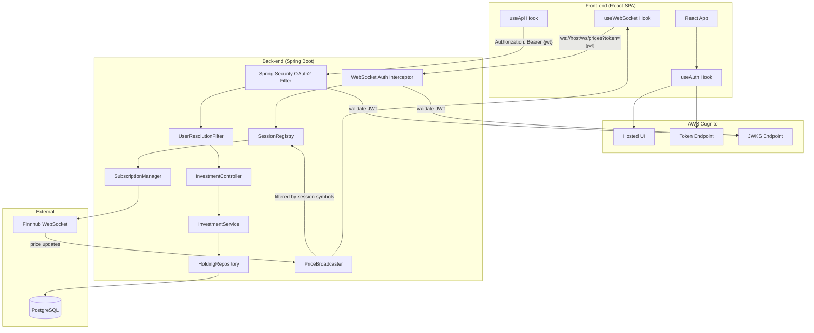
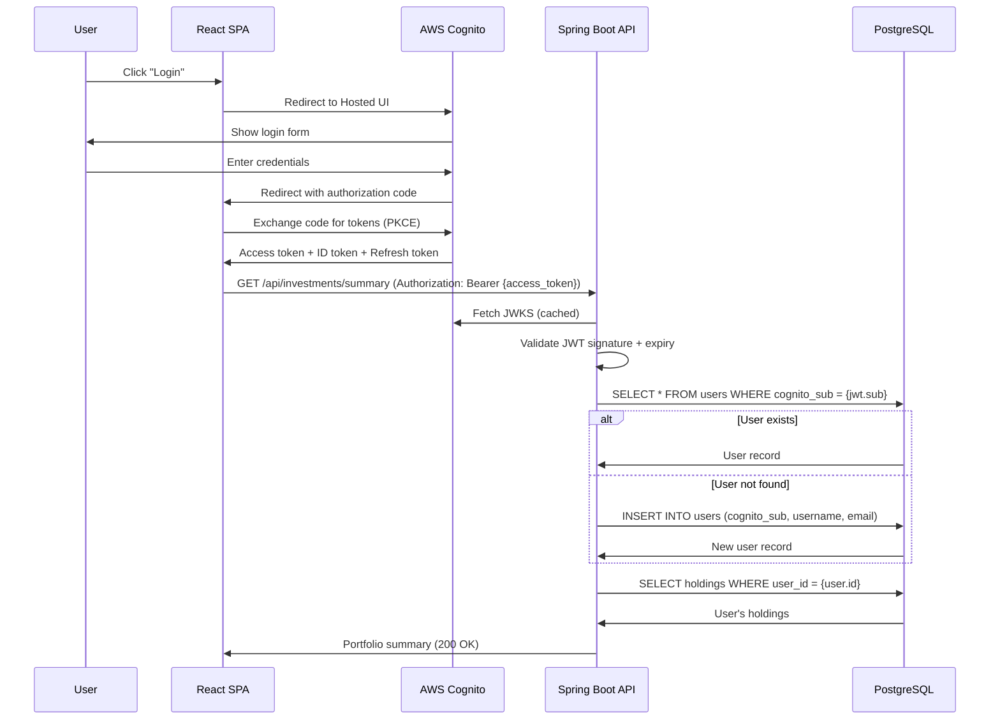

# Design Document: Multi-User Authentication & Data Isolation

## Overview

This design evolves the Investment Tracker from a single-user personal tool to a multi-user application with AWS Cognito authentication, normalized database schema, user-scoped data access, and per-user WebSocket filtering. The core architectural changes are:

1. **Database normalization** — Replace the flat `investments` table with `symbols`, `users`, and `holdings` tables
2. **Authentication** — Spring Security OAuth2 Resource Server validating Cognito JWTs
3. **User-scoped queries** — All data access filtered by authenticated user
4. **WebSocket subscription reference counting** — Track how many connected users need each symbol
5. **Per-user price filtering** — Deliver updates only to sessions that care about a given symbol
6. **Front-end auth integration** — Cognito Hosted UI with token management

## Architecture



### Authentication Flow



## Components and Interfaces

### Spring Security Configuration

**Class:** `SecurityConfig` (new)
**Package:** `com.investmenttracker.config`

```java
@Configuration
@EnableWebSecurity
public class SecurityConfig {

    @Bean
    public SecurityFilterChain filterChain(HttpSecurity http) throws Exception {
        http
            .csrf(csrf -> csrf.disable())
            .sessionManagement(sm -> sm.sessionCreationPolicy(SessionCreationPolicy.STATELESS))
            .authorizeHttpRequests(auth -> auth
                .requestMatchers("/actuator/health").permitAll()
                .requestMatchers("/ws/**").permitAll() // WebSocket auth handled separately
                .requestMatchers("/api/**").authenticated()
                .anyRequest().permitAll()
            )
            .oauth2ResourceServer(oauth2 -> oauth2
                .jwt(jwt -> jwt.jwtAuthenticationConverter(jwtAuthConverter()))
            );
        return http.build();
    }

    private JwtAuthenticationConverter jwtAuthConverter() {
        JwtAuthenticationConverter converter = new JwtAuthenticationConverter();
        converter.setPrincipalClaimName("sub");
        return converter;
    }
}
```

**Configuration properties:**
```properties
spring.security.oauth2.resourceserver.jwt.issuer-uri=https://cognito-idp.${AWS_REGION}.amazonaws.com/${COGNITO_USER_POOL_ID}
spring.security.oauth2.resourceserver.jwt.jwk-set-uri=https://cognito-idp.${AWS_REGION}.amazonaws.com/${COGNITO_USER_POOL_ID}/.well-known/jwks.json
```

### User Resolution Filter

**Class:** `UserResolutionFilter` (new)
**Package:** `com.investmenttracker.auth`

Runs after Spring Security's JWT validation. Extracts the `sub` claim from the authenticated principal, resolves or auto-provisions the user, and stores the `User` entity in a request-scoped attribute.

```java
@Component
public class UserResolutionFilter extends OncePerRequestFilter {

    private final UserRepository userRepository;

    @Override
    protected void doFilterInternal(HttpServletRequest request,
                                     HttpServletResponse response,
                                     FilterChain filterChain) {
        Authentication auth = SecurityContextHolder.getContext().getAuthentication();
        if (auth instanceof JwtAuthenticationToken jwtAuth) {
            Jwt jwt = jwtAuth.getToken();
            String sub = jwt.getSubject();
            String username = jwt.getClaimAsString("cognito:username");
            String email = jwt.getClaimAsString("email");

            User user = userRepository.findByCognitoSub(sub)
                .orElseGet(() -> {
                    User newUser = new User();
                    newUser.setCognitoSub(sub);
                    newUser.setUsername(username != null ? username : sub);
                    newUser.setEmail(email != null ? email : sub + "@unknown");
                    return userRepository.save(newUser);
                });

            request.setAttribute("authenticatedUser", user);
        }
        filterChain.doFilter(request, response);
    }
}
```

### WebSocket Authentication Handshake Interceptor

**Class:** `WebSocketAuthInterceptor` (new)
**Package:** `com.investmenttracker.config`

Intercepts the WebSocket upgrade handshake, extracts the JWT from the `token` query parameter, validates it using Spring Security's `JwtDecoder`, and stores the resolved user on the WebSocket session attributes.

```java
@Component
public class WebSocketAuthInterceptor implements HandshakeInterceptor {

    private final JwtDecoder jwtDecoder;
    private final UserRepository userRepository;

    @Override
    public boolean beforeHandshake(ServerHttpRequest request,
                                    ServerHttpResponse response,
                                    WebSocketHandler wsHandler,
                                    Map<String, Object> attributes) {
        String token = extractTokenFromQuery(request.getURI());
        if (token == null) {
            response.setStatusCode(HttpStatus.UNAUTHORIZED);
            return false; // reject connection
        }
        try {
            Jwt jwt = jwtDecoder.decode(token);
            String sub = jwt.getSubject();
            User user = userRepository.findByCognitoSub(sub).orElse(null);
            if (user == null) {
                // Auto-provision
                user = autoProvision(jwt);
            }
            attributes.put("user", user);
            return true;
        } catch (JwtException e) {
            response.setStatusCode(HttpStatus.UNAUTHORIZED);
            return false;
        }
    }
}
```

### Session Registry

**Class:** `SessionRegistry` (new)
**Package:** `com.investmenttracker.websocket`

Maintains two concurrent data structures for per-user filtering and reference counting:

```java
@Component
public class SessionRegistry {

    // session ID → set of symbols that session needs updates for
    private final ConcurrentHashMap<String, Set<String>> sessionSymbols = new ConcurrentHashMap<>();

    // session ID → User entity (for resolving who owns each session)
    private final ConcurrentHashMap<String, User> sessionUsers = new ConcurrentHashMap<>();

    // symbol → set of session IDs interested in that symbol (for reference counting)
    private final ConcurrentHashMap<String, Set<String>> symbolSessions = new ConcurrentHashMap<>();

    public void registerSession(String sessionId, User user, Set<String> symbols);
    public void unregisterSession(String sessionId);
    public void addSymbolToSession(String sessionId, String symbol);
    public void removeSymbolFromSession(String sessionId, String symbol);
    public Set<String> getSessionsForSymbol(String symbol);
    public Set<String> getSymbolsForSession(String sessionId);
    public int getSubscriberCount(String symbol);
}
```

### Refactored SubscriptionManager

**Class:** `SubscriptionManager` (modified)
**Package:** `com.investmenttracker.finnhub`

Changes from `CopyOnWriteArraySet<String>` to `ConcurrentHashMap<String, AtomicInteger>` for reference counting:

```java
@Component
public class SubscriptionManager {

    // symbol → number of distinct sessions that need this symbol
    private final ConcurrentHashMap<String, AtomicInteger> refCounts = new ConcurrentHashMap<>();

    /**
     * Increments the reference count for a symbol.
     * Returns true if this is the first reference (count transitioned 0 → 1),
     * meaning Finnhub subscribe should be sent.
     */
    public boolean increment(String symbol) {
        AtomicInteger count = refCounts.computeIfAbsent(symbol, k -> new AtomicInteger(0));
        return count.incrementAndGet() == 1;
    }

    /**
     * Decrements the reference count for a symbol.
     * Returns true if this was the last reference (count transitioned 1 → 0),
     * meaning Finnhub unsubscribe should be sent.
     */
    public boolean decrement(String symbol) {
        AtomicInteger count = refCounts.get(symbol);
        if (count == null) return false;
        int newVal = count.decrementAndGet();
        if (newVal <= 0) {
            refCounts.remove(symbol);
            return true;
        }
        return false;
    }

    public Set<String> getSubscribedSymbols() {
        return Set.copyOf(refCounts.keySet());
    }

    public void resubscribeAll(Consumer<String> subscribeAction) {
        for (String symbol : refCounts.keySet()) {
            subscribeAction.accept(symbol);
        }
    }
}
```

### Refactored PriceBroadcaster

**Class:** `PriceBroadcaster` (modified)
**Package:** `com.investmenttracker.websocket`

Instead of broadcasting to all sessions, uses `SessionRegistry` to filter:

```java
@Component
public class PriceBroadcaster {

    private final ObjectMapper objectMapper;
    private final SessionRegistry sessionRegistry;

    public void broadcast(PriceUpdate priceUpdate) {
        String json = objectMapper.writeValueAsString(priceUpdate);
        String symbol = priceUpdate.symbol();

        // Only send to sessions that care about this symbol
        Set<String> interestedSessionIds = sessionRegistry.getSessionsForSymbol(symbol);
        if (interestedSessionIds.isEmpty()) {
            return; // discard — no one is watching
        }

        for (String sessionId : interestedSessionIds) {
            WebSocketSession session = sessionRegistry.getWebSocketSession(sessionId);
            if (session != null && session.isOpen()) {
                session.sendMessage(new TextMessage(json));
            }
        }
    }
}
```

### Updated Entity Classes

**User entity (new):**
```java
@Entity
@Table(name = "users")
public class User {
    @Id @GeneratedValue(strategy = GenerationType.IDENTITY)
    private Long id;

    @Column(name = "username", nullable = false, unique = true)
    private String username;

    @Column(name = "email", nullable = false, unique = true)
    private String email;

    @Column(name = "cognito_sub", nullable = false, unique = true)
    private String cognitoSub;

    @Column(name = "created_at", nullable = false, updatable = false)
    private OffsetDateTime createdAt;

    @PrePersist
    protected void onCreate() { this.createdAt = OffsetDateTime.now(); }
}
```

**Symbol entity (new):**
```java
@Entity
@Table(name = "symbols")
public class Symbol {
    @Id @GeneratedValue(strategy = GenerationType.IDENTITY)
    private Long id;

    @Column(name = "ticker", nullable = false, unique = true, length = 20)
    private String ticker;

    @Column(name = "name")
    private String name;

    @Column(name = "exchange", length = 50)
    private String exchange;

    @Column(name = "asset_type", length = 20)
    private String assetType;

    @Column(name = "updated_at", nullable = false)
    private OffsetDateTime updatedAt;

    @PrePersist @PreUpdate
    protected void onUpdate() { this.updatedAt = OffsetDateTime.now(); }
}
```

**Holding entity (replaces Investment):**
```java
@Entity
@Table(name = "holdings")
public class Holding {
    @Id @GeneratedValue(strategy = GenerationType.IDENTITY)
    private Long id;

    @ManyToOne(fetch = FetchType.LAZY)
    @JoinColumn(name = "user_id", nullable = false)
    private User user;

    @ManyToOne(fetch = FetchType.LAZY)
    @JoinColumn(name = "symbol_id", nullable = false)
    private Symbol symbol;

    @Column(name = "quantity", nullable = false, precision = 18, scale = 8)
    private BigDecimal quantity;

    @Column(name = "platform", length = 100)
    private String platform;

    @Column(name = "average_cost", precision = 18, scale = 8)
    private BigDecimal averageCost;

    @Column(name = "created_at", nullable = false, updatable = false)
    private OffsetDateTime createdAt;

    @Column(name = "updated_at", nullable = false)
    private OffsetDateTime updatedAt;

    @PrePersist
    protected void onCreate() {
        this.createdAt = OffsetDateTime.now();
        this.updatedAt = OffsetDateTime.now();
    }

    @PreUpdate
    protected void onUpdate() { this.updatedAt = OffsetDateTime.now(); }
}
```

### Updated Repository Layer

```java
@Repository
public interface UserRepository extends JpaRepository<User, Long> {
    Optional<User> findByCognitoSub(String cognitoSub);
}

@Repository
public interface SymbolRepository extends JpaRepository<Symbol, Long> {
    Optional<Symbol> findByTicker(String ticker);
}

@Repository
public interface HoldingRepository extends JpaRepository<Holding, Long> {
    List<Holding> findByUser(User user);
    List<Holding> findByUserAndSymbol_Ticker(User user, String ticker);
    boolean existsBySymbol_Ticker(String ticker);

    @Query("SELECT DISTINCT h.symbol.ticker FROM Holding h")
    List<String> findDistinctSymbolTickers();

    @Query("SELECT DISTINCT h.symbol.ticker FROM Holding h WHERE h.user = :user")
    Set<String> findDistinctTickersByUser(@Param("user") User user);
}
```

### Updated Service Layer

The `InvestmentService` is refactored to `HoldingService` with user-scoped operations:

```java
@Service
public class HoldingService {

    private final HoldingRepository holdingRepository;
    private final SymbolRepository symbolRepository;
    private final SubscriptionManager subscriptionManager;
    private final SessionRegistry sessionRegistry;
    private final FinnhubClient finnhubClient;

    @Transactional
    public Holding createHolding(User user, HoldingRequest request) {
        Symbol symbol = symbolRepository.findByTicker(request.getSymbol())
            .orElseGet(() -> {
                Symbol s = new Symbol();
                s.setTicker(request.getSymbol());
                return symbolRepository.save(s);
            });

        Holding holding = new Holding();
        holding.setUser(user);
        holding.setSymbol(symbol);
        holding.setQuantity(request.getQuantity());
        holding.setPlatform(request.getPlatform());
        holding.setAverageCost(request.getAverageCost());
        Holding saved = holdingRepository.save(holding);

        // Update subscriptions — increment reference count
        boolean shouldSubscribe = subscriptionManager.increment(symbol.getTicker());
        if (shouldSubscribe) {
            finnhubClient.subscribe(symbol.getTicker());
        }

        // Update connected session's symbol set
        sessionRegistry.addSymbolToUserSessions(user, symbol.getTicker());

        return saved;
    }

    @Transactional(readOnly = true)
    public List<Holding> getUserHoldings(User user) {
        return holdingRepository.findByUser(user);
    }

    @Transactional
    public void deleteHolding(User user, Long holdingId) {
        Holding holding = holdingRepository.findById(holdingId)
            .orElseThrow(() -> new EntityNotFoundException("Holding not found: " + holdingId));

        if (!holding.getUser().getId().equals(user.getId())) {
            throw new AccessDeniedException("Cannot delete another user's holding");
        }

        String ticker = holding.getSymbol().getTicker();
        holdingRepository.delete(holding);

        // Check if user still holds this symbol on another platform
        boolean userStillHolds = holdingRepository
            .findByUserAndSymbol_Ticker(user, ticker).size() > 0;

        if (!userStillHolds) {
            sessionRegistry.removeSymbolFromUserSessions(user, ticker);
        }

        // Decrement reference count
        boolean shouldUnsubscribe = subscriptionManager.decrement(ticker);
        if (shouldUnsubscribe) {
            finnhubClient.unsubscribe(ticker);
        }
    }
}
```

### Updated Controller

```java
@RestController
@RequestMapping("/api/investments")
public class InvestmentController {

    private final HoldingService holdingService;

    @GetMapping("/summary")
    public ResponseEntity<List<PortfolioSummaryResponse>> getPortfolioSummary(
            HttpServletRequest request) {
        User user = (User) request.getAttribute("authenticatedUser");
        List<PortfolioSummaryResponse> summary = holdingService.getPortfolioSummary(user);
        return ResponseEntity.ok(summary);
    }

    @PostMapping
    public ResponseEntity<InvestmentResponse> createHolding(
            @Valid @RequestBody HoldingRequest holdingRequest,
            HttpServletRequest request) {
        User user = (User) request.getAttribute("authenticatedUser");
        Holding created = holdingService.createHolding(user, holdingRequest);
        return ResponseEntity.status(HttpStatus.CREATED)
            .body(InvestmentResponse.from(created));
    }

    @DeleteMapping("/{id}")
    public ResponseEntity<Void> deleteHolding(
            @PathVariable Long id, HttpServletRequest request) {
        User user = (User) request.getAttribute("authenticatedUser");
        holdingService.deleteHolding(user, id);
        return ResponseEntity.noContent().build();
    }
}
```

### Front-end Auth Integration

**New `useAuth` hook:**
```javascript
// src/hooks/useAuth.js
const COGNITO_DOMAIN = import.meta.env.VITE_COGNITO_DOMAIN;
const CLIENT_ID = import.meta.env.VITE_COGNITO_CLIENT_ID;
const REDIRECT_URI = import.meta.env.VITE_COGNITO_REDIRECT_URI;

export default function useAuth() {
    const [token, setToken] = useState(localStorage.getItem('access_token'));
    const [user, setUser] = useState(null);

    function login() {
        const url = `${COGNITO_DOMAIN}/oauth2/authorize?` +
            `client_id=${CLIENT_ID}&response_type=code&` +
            `scope=openid+email+profile&redirect_uri=${REDIRECT_URI}`;
        window.location.href = url;
    }

    function logout() {
        localStorage.removeItem('access_token');
        localStorage.removeItem('refresh_token');
        setToken(null);
        setUser(null);
    }

    async function handleCallback(code) {
        // Exchange code for tokens via Cognito token endpoint
        const tokens = await exchangeCode(code);
        localStorage.setItem('access_token', tokens.access_token);
        localStorage.setItem('refresh_token', tokens.refresh_token);
        setToken(tokens.access_token);
    }

    return { token, user, login, logout, handleCallback, isAuthenticated: !!token };
}
```

**Updated `useApi` hook** — attaches Bearer token:
```javascript
async function request(endpoint, options = {}) {
    const token = localStorage.getItem('access_token');
    const headers = {
        'Content-Type': 'application/json',
        ...options.headers,
    };
    if (token) {
        headers['Authorization'] = `Bearer ${token}`;
    }
    // ... rest unchanged
}
```

**Updated `useWebSocket` hook** — passes token as query param:
```javascript
export default function useWebSocket(baseUrl, options = {}) {
    // Append token to WebSocket URL
    const token = localStorage.getItem('access_token');
    const url = token ? `${baseUrl}?token=${token}` : baseUrl;
    // ... rest unchanged
}
```

### WebSocket Architecture Change

The current architecture uses JSR-356 `@ServerEndpoint` with static session management. For multi-user with Spring Security integration, we migrate to **Spring WebSocket with `WebSocketHandler`** and `HandshakeInterceptor`:

```java
@Configuration
@EnableWebSocket
public class WebSocketConfig implements WebSocketConfigurer {

    private final PriceWebSocketHandler priceWebSocketHandler;
    private final WebSocketAuthInterceptor authInterceptor;

    @Override
    public void registerWebSocketHandlers(WebSocketHandlerRegistry registry) {
        registry.addHandler(priceWebSocketHandler, "/ws/prices")
            .addInterceptors(authInterceptor)
            .setAllowedOrigins("${app.frontend-origin}");
    }
}
```

This replaces the JSR-356 `PriceWebSocketEndpoint` and `WebSocketServerConfig` with Spring-managed handlers that have full access to DI and the `SessionRegistry`.

## Data Models

### Database Schema (Target State)

```sql
-- V3__multi_user_schema.sql

CREATE TABLE symbols (
    id          BIGSERIAL PRIMARY KEY,
    ticker      VARCHAR(20) NOT NULL UNIQUE,
    name        VARCHAR(255),
    exchange    VARCHAR(50),
    asset_type  VARCHAR(20),
    updated_at  TIMESTAMPTZ NOT NULL DEFAULT NOW()
);

CREATE TABLE users (
    id          BIGSERIAL PRIMARY KEY,
    username    VARCHAR(50) NOT NULL UNIQUE,
    email       VARCHAR(255) NOT NULL UNIQUE,
    cognito_sub VARCHAR(255) NOT NULL UNIQUE,
    created_at  TIMESTAMPTZ NOT NULL DEFAULT NOW()
);

CREATE TABLE holdings (
    id          BIGSERIAL PRIMARY KEY,
    user_id     BIGINT NOT NULL REFERENCES users(id) ON DELETE CASCADE,
    symbol_id   BIGINT NOT NULL REFERENCES symbols(id),
    quantity    DECIMAL(18, 8) NOT NULL,
    platform    VARCHAR(100),
    average_cost DECIMAL(18, 8),
    created_at  TIMESTAMPTZ NOT NULL DEFAULT NOW(),
    updated_at  TIMESTAMPTZ NOT NULL DEFAULT NOW(),
    UNIQUE (user_id, symbol_id, platform)
);

CREATE INDEX idx_holdings_user_id ON holdings(user_id);
CREATE INDEX idx_holdings_symbol_id ON holdings(symbol_id);
CREATE INDEX idx_symbols_ticker ON symbols(ticker);
```

### Migration Strategy (V3)

The Flyway migration script will:

1. Create `symbols` table
2. Create `users` table
3. Create `holdings` table with FK constraints and indexes
4. Insert distinct symbols from `investments` into `symbols`
5. Create a default user (`username='default_user'`, `email='default@local'`, `cognito_sub='legacy-migration'`)
6. Migrate all `investments` rows into `holdings` (joining through `symbols` for `symbol_id`)
7. Drop the `investments` table

```sql
-- Step 4: Extract symbols
INSERT INTO symbols (ticker, updated_at)
SELECT DISTINCT symbol, NOW() FROM investments;

-- Step 5: Default migration user
INSERT INTO users (username, email, cognito_sub, created_at)
VALUES ('default_user', 'default@local', 'legacy-migration', NOW());

-- Step 6: Migrate holdings
INSERT INTO holdings (user_id, symbol_id, quantity, platform, average_cost, created_at, updated_at)
SELECT
    (SELECT id FROM users WHERE cognito_sub = 'legacy-migration'),
    s.id,
    i.quantity,
    i.platform,
    i.average_cost,
    i.created_at,
    NOW()
FROM investments i
JOIN symbols s ON s.ticker = i.symbol;

-- Step 7: Drop old table
DROP TABLE investments;
```

### Request/Response DTOs

The REST API contract remains backward-compatible. `HoldingRequest` matches the existing `InvestmentRequest` shape. `InvestmentResponse` and `PortfolioSummaryResponse` continue to use the same JSON structure — the front-end contract does not break.

## Correctness Properties

*A property is a characteristic or behavior that should hold true across all valid executions of a system — essentially, a formal statement about what the system should do. Properties serve as the bridge between human-readable specifications and machine-verifiable correctness guarantees.*

### Property 1: User Resolution Consistency

*For any* valid JWT with a `sub` claim that maps to an existing user in the database, the user resolution logic SHALL always return the same user record regardless of whether the request arrives via HTTP or WebSocket.

**Validates: Requirements 3.4, 7.3**

### Property 2: Auto-Provisioning Correctness

*For any* valid JWT containing a `sub` claim not present in the users table, the system SHALL create exactly one new user record with `cognito_sub`, `username`, and `email` matching the JWT claims, and subsequent requests with the same `sub` SHALL resolve to that same user.

**Validates: Requirements 3.5**

### Property 3: User Data Isolation

*For any* two distinct users A and B with their own holdings, querying portfolio data as user A SHALL return only holdings where `user_id = A.id`, and no holdings belonging to user B SHALL appear in the results.

**Validates: Requirements 4.1, 4.2**

### Property 4: Ownership Enforcement

*For any* holding owned by user A, only user A SHALL be able to create, update, or delete that holding. Any mutation attempt by user B (where B ≠ A) SHALL be rejected with HTTP 403, and the holding SHALL remain unchanged.

**Validates: Requirements 4.3, 4.4, 4.5, 4.6**

### Property 5: Reference Count Invariant

*For any* sequence of session connect/disconnect operations, the reference count for each symbol SHALL equal the number of distinct connected sessions whose symbol set includes that symbol, and exactly one Finnhub subscription SHALL exist per symbol with a count > 0.

**Validates: Requirements 5.2, 5.4**

### Property 6: Subscribe on First Interest

*For any* symbol with a current reference count of zero, when the first session requiring that symbol registers, the system SHALL send exactly one subscribe message to Finnhub and the reference count SHALL become 1.

**Validates: Requirements 5.1, 5.5**

### Property 7: Unsubscribe on Last Interest

*For any* symbol with a current reference count of one, when the last session requiring that symbol unregisters, the system SHALL send exactly one unsubscribe message to Finnhub and the reference count SHALL become 0.

**Validates: Requirements 5.3, 5.6**

### Property 8: Per-User Price Update Filtering

*For any* price update for symbol S and any set of connected sessions, the update SHALL be delivered only to sessions whose symbol set contains S, and SHALL not be delivered to any session whose symbol set does not contain S.

**Validates: Requirements 6.2, 6.6**

### Property 9: Session Registry Accuracy

*For any* connected user, the session's symbol set SHALL at all times equal the set of distinct tickers from that user's current holdings. Adding a holding adds the ticker to the set; removing the last holding for a ticker removes it from the set.

**Validates: Requirements 6.1, 6.3, 6.4, 6.5**

### Property 10: Front-end Token Attachment

*For any* API request made by the front-end while a token exists in storage, the request SHALL include an `Authorization: Bearer {token}` header.

**Validates: Requirements 3.7**

## Error Handling

| Scenario | HTTP Status | Response Body |
|----------|-------------|---------------|
| Missing/invalid JWT on API request | 401 | `{"error": "Unauthorized", "message": "Invalid or missing token"}` |
| Expired JWT | 401 | `{"error": "Unauthorized", "message": "Token expired"}` |
| Valid JWT but accessing another user's holding | 403 | `{"error": "Forbidden", "message": "Access denied"}` |
| Holding not found | 404 | `{"error": "Not Found", "message": "Holding not found with id: {id}"}` |
| WebSocket connection without token | Connection rejected (HTTP 401 during handshake) | N/A |
| WebSocket connection with invalid/expired token | Connection rejected (HTTP 401 during handshake) | N/A |
| Duplicate holding (same user + symbol + platform) | 409 | `{"error": "Conflict", "message": "Holding already exists for this symbol and platform"}` |

### Token Refresh Strategy

- The front-end stores the refresh token in `localStorage`
- When an API call returns 401, the `useApi` hook attempts a silent token refresh via Cognito's token endpoint
- If refresh succeeds, the original request is retried with the new token
- If refresh fails (refresh token expired), the user is redirected to login

## Testing Strategy

### Unit Tests (JUnit 5)

- `UserResolutionFilter`: Test extraction of claims, auto-provisioning, and resolution to existing users
- `HoldingService`: Test user-scoped CRUD, ownership checks, subscription management coordination
- `SecurityConfig`: Test that unauthenticated requests are rejected, authenticated requests pass through
- WebSocket handshake interceptor: Test token extraction from query params, rejection on invalid token

### Property-Based Tests (jqwik)

Property-based testing is appropriate for this feature because several components have universal properties that should hold across a wide range of inputs — particularly the reference counting logic, data isolation queries, and session filtering.

- **Library:** jqwik 1.9.1 (already in pom.xml)
- **Minimum iterations:** 100 per property
- **Tag format:** `Feature: multi-user-auth, Property {N}: {title}`

Properties to implement as PBT:
- Property 3 (User Data Isolation): Generate random users with random holdings, verify query isolation
- Property 4 (Ownership Enforcement): Generate random users and holdings, verify cross-user mutation rejection
- Property 5 (Reference Count Invariant): Generate random sequences of increment/decrement, verify count correctness
- Property 6 (Subscribe on First Interest): Generate sequences that transition count from 0→1
- Property 7 (Unsubscribe on Last Interest): Generate sequences that transition count from 1→0
- Property 8 (Per-User Filtering): Generate random sessions with symbol sets and random price updates, verify delivery correctness
- Property 9 (Session Registry Accuracy): Generate sequences of add/remove holding operations, verify session symbol set

### Integration Tests (Testcontainers)

- Full Flyway migration test against PostgreSQL container
- End-to-end API tests with mocked JWT tokens
- WebSocket connection tests with token validation

### Front-end Tests (Vitest + fast-check)

- Property 10 (Token Attachment): Generate random endpoint paths, verify Authorization header is always present
- `useAuth` hook: Test login redirect URL construction, token storage, logout cleanup
