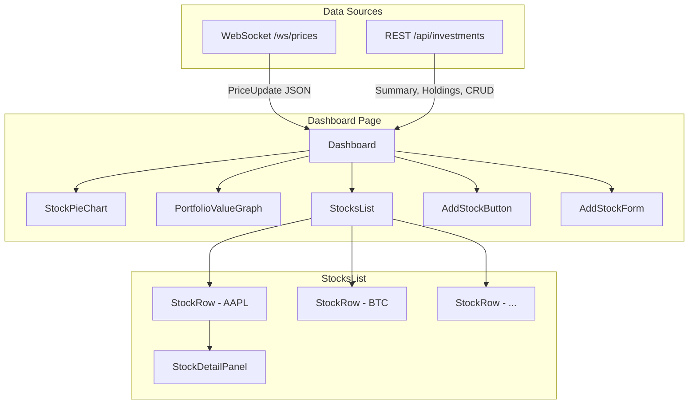
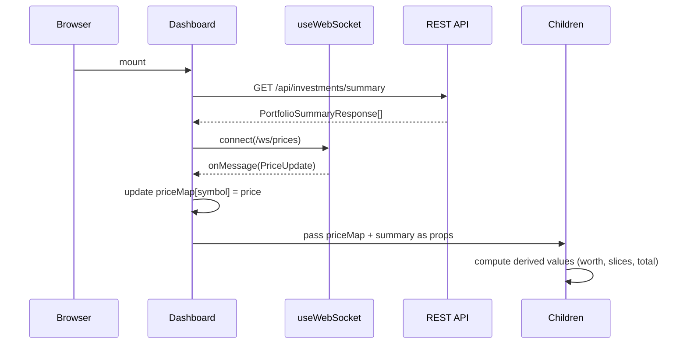

# Design Document: Portfolio Dashboard UI

**Related steering:** #[[file:../../steering/data-fetching.md]]

## Overview

The Portfolio Dashboard UI is a single-page React component tree that renders a real-time investment portfolio view. It consumes the existing Spring Boot REST API (`/api/investments`) for CRUD operations and portfolio summary data, and connects to a native WebSocket endpoint (`/ws/prices`) for live price streaming.

The dashboard is structured as a top-down data flow: a single WebSocket connection feeds price updates into a shared price map, which all child components read from to compute derived values (portfolio total, pie chart slices, per-row worth). REST API calls handle initial data loading and mutations (add/edit/delete holdings).

**Key design decisions:**
- **Single WebSocket hook** at the Dashboard level, shared via props (no context needed for a single-page app with one consumer tree)
- **Recharts** for charting — declarative React components, supports pie and line charts, React 19 compatible (v3.x), ~45kB gzipped
- **No global state library** — React state + props are sufficient for a single-page, single-user app
- **Co-located CSS** per project conventions
- **Summary endpoint only** on mount — no full holdings fetch needed (per data-fetching steering doc)

## Architecture



### Data Flow



## Components and Interfaces

### Component Hierarchy

```
src/Pages/Dashboard/
├── Dashboard.jsx              # Page root — owns state, WebSocket, REST calls
├── Dashboard.css
├── utils.js                   # Shared utility functions
├── Charts/
│   ├── StockPieChart.jsx      # Pie chart by symbol
│   ├── StockPieChart.css
│   ├── PortfolioValueGraph.jsx # Real-time line chart + total value label
│   └── PortfolioValueGraph.css
├── Stocks/
│   ├── StocksList.jsx         # Container for stock rows
│   ├── StocksList.css
│   ├── StockRow.jsx           # Single symbol row (expandable)
│   ├── StockRow.css
│   ├── StockDetailPanel.jsx   # Expanded per-platform holdings
│   ├── StockDetailPanel.css
│   ├── AddStockButton.jsx     # Trigger for add form
│   ├── AddStockButton.css
│   ├── AddStockForm.jsx       # Modal/inline form for new investment
│   └── AddStockForm.css
└── Status/
    ├── ConnectionIndicator.jsx # WebSocket status badge
    ├── ConnectionIndicator.css
    ├── DashboardSkeleton.jsx  # Loading skeleton
    └── DashboardSkeleton.css

src/hooks/
├── useWebSocket.js            # WebSocket connection + reconnect logic
└── useApi.js                  # REST API helper (fetch wrapper)
```

### Component Props Interfaces

```javascript
// Dashboard (page root) — no props, owns all state
// State: { summary, priceMap, dataPoints, wsStatus, loading, error }

// StockPieChart
// props: { summary: PortfolioSummary[], priceMap: Map<string, number> }

// PortfolioValueGraph
// props: { dataPoints: Array<{time, value}>, currentTotal: number, loading: boolean }

// StocksList
// props: { summary: PortfolioSummary[], priceMap: Map<string, number>, onHoldingChanged: fn }

// StockRow
// props: { symbol, totalQuantity, price, isExpanded, onToggle: fn, onHoldingChanged: fn }

// StockDetailPanel
// props: { symbol, onHoldingChanged: fn }

// AddStockForm
// props: { open: boolean, onClose: fn, onCreated: fn }

// ConnectionIndicator
// props: { status: 'connected' | 'reconnecting' | 'failed' }
```

### Hook Interfaces

```javascript
// useWebSocket(url, options)
// Returns: { status, lastMessage, connect, disconnect }
// options: { onMessage: fn, reconnect: boolean, maxAttempts: 10 }

// useApi()
// Returns: { get, post, put, del }
// Each method returns Promise<{ data, error, status }>
```

## Data Models

### REST API Response Shapes (from back-end)

```javascript
// GET /api/investments/summary
// PortfolioSummaryResponse
{
  symbol: "AAPL",          // string
  totalQuantity: 15.5,     // number (BigDecimal serialized)
  holdingCount: 3          // number
}

// GET /api/investments/symbol/{symbol}
// HoldingDetailResponse
{
  id: 42,                  // number
  quantity: 5.25,          // number
  platform: "Robinhood",   // string | null
  createdAt: "2024-01-15T10:30:00Z"  // ISO-8601 string
}

// POST/PUT /api/investments
// InvestmentRequest (body)
{
  symbol: "AAPL",          // string, max 20, required for POST
  quantity: 10.5,          // number, 0.000001–999999999.99
  platform: "Robinhood"   // string | null, max 100
}

// InvestmentResponse (response)
{
  id: 42,
  symbol: "AAPL",
  quantity: 10.5,
  platform: "Robinhood",
  createdAt: "2024-01-15T10:30:00Z"
}
```

### WebSocket Message Shape

```javascript
// Received from /ws/prices (JSON text frame)
// PriceUpdate
{
  symbol: "AAPL",                    // string
  price: 178.52,                     // number (BigDecimal)
  timestamp: "2024-01-15T14:30:00.123Z"  // ISO-8601 UTC
}
```

### Front-end State Shape (Dashboard component)

```javascript
{
  // From REST API — GET /api/investments/summary (initial load + after CRUD)
  summary: [
    { symbol: "AAPL", totalQuantity: 15.5, holdingCount: 3 },
    { symbol: "BINANCE:BTCUSDT", totalQuantity: 0.5, holdingCount: 1 }
  ],

  // From WebSocket (updated on each PriceUpdate)
  priceMap: {
    "AAPL": 178.52,
    "BINANCE:BTCUSDT": 67234.10
  },

  // Derived: time-series for portfolio value graph (max 200 points)
  dataPoints: [
    { time: "14:30:00", value: 36382.11 },
    { time: "14:30:05", value: 36390.45 }
  ],

  // WebSocket connection status
  wsStatus: "connected", // "connected" | "reconnecting" | "failed"

  // Loading/error for initial fetch
  loading: true,
  error: null
}
```

### Derived Computations

```javascript
// Total portfolio value (for graph + display)
// sum of (summary[i].totalQuantity * priceMap[summary[i].symbol]) for all i

// Stock pie chart slices — uses summary data
// slice.value = summary[i].totalQuantity * priceMap[summary[i].symbol]
// slice.percentage = slice.value / totalPortfolioValue * 100
```

### CRUD Refetch Strategy

Per the data-fetching steering doc, after any successful CRUD operation:

| Operation | Refetch |
|-----------|---------|
| Create (`POST /api/investments`) | Refetch summary |
| Update (`PUT /api/investments/{id}`) | Refetch summary + per-symbol if detail panel is open |
| Delete (`DELETE /api/investments/{id}`) | Refetch summary + per-symbol if detail panel is open |

The `onHoldingChanged` callback in Dashboard triggers these refetches. Price data from WebSocket is never refetched — only the holdings/summary REST data is refreshed after mutations.

## Correctness Properties

*A property is a characteristic or behavior that should hold true across all valid executions of a system — essentially, a formal statement about what the system should do. Properties serve as the bridge between human-readable specifications and machine-verifiable correctness guarantees.*

### Property 1: Stock pie slice proportions with price filtering

*For any* portfolio summary array and any price map (which may not contain all symbols), the stock pie chart data SHALL include only symbols present in both the summary and the price map, each slice's proportion SHALL equal (totalQuantity × price) / (sum of all included symbols' values), and the legend SHALL contain one entry per included symbol with the matching percentage.

**Validates: Requirements 2.1, 2.4, 2.5**

### Property 2: Total portfolio value computation

*For any* portfolio summary array and price map, the computed total portfolio value SHALL equal the sum of (summary[i].totalQuantity × priceMap[summary[i].symbol]) for all symbols that exist in both the summary and the price map.

**Validates: Requirements 3.2**

### Property 3: Data points buffer bounded at 200 with FIFO eviction

*For any* sequence of N appended data points (where N ≥ 0), the resulting buffer SHALL contain at most 200 entries, and when N > 200 the buffer SHALL contain exactly the last 200 appended points in chronological order (oldest discarded first).

**Validates: Requirements 3.3**

### Property 4: Currency formatting produces exactly 2 decimal places

*For any* non-negative number, the currency formatting function SHALL produce a string matching the pattern `$X,XXX.XX` (with appropriate grouping separators) where the fractional part always contains exactly 2 digits.

**Validates: Requirements 3.5, 4.3**

### Property 5: Quantity formatting produces up to 4 decimal places

*For any* positive number representing a quantity, the quantity formatting function SHALL produce a string with at most 4 decimal places, trailing zeros removed (except that at least one decimal place is shown for fractional values).

**Validates: Requirements 4.3**

### Property 6: Accordion invariant — at most one panel expanded

*For any* sequence of toggle actions on stock rows, at most one Stock_Detail_Panel SHALL be in the expanded state at any given time. Toggling an already-expanded row SHALL collapse it (resulting in zero expanded panels).

**Validates: Requirements 5.1**

### Property 7: Null platform display text

*For any* holding detail where the platform field is null or an empty string, the display function SHALL render the text "No platform" in place of the platform name.

**Validates: Requirements 5.4**

### Property 8: Investment form validation

*For any* form input where the symbol is blank or exceeds 20 characters, OR the quantity is outside the range [0.000001, 999999999.99], OR the platform exceeds 100 characters, the validation function SHALL return one or more error messages identifying each invalid field and SHALL prevent submission. *For any* form input where all constraints are satisfied, the validation function SHALL return no errors.

**Validates: Requirements 5.5, 6.5, 8.3**

### Property 9: Symbol row removal when all holdings deleted

*For any* stocks list state, after all holdings for a given symbol are removed from the underlying data, the stocks list SHALL no longer contain a row for that symbol.

**Validates: Requirements 7.5**

### Property 10: Exponential backoff delay computation

*For any* reconnection attempt number N (where 1 ≤ N ≤ 10), the computed delay SHALL equal min(1000 × 2^(N−1), 30000) milliseconds. No further attempts SHALL be made after attempt 10.

**Validates: Requirements 10.3**

## Error Handling

### Network Errors (REST API)

| Scenario | Behavior |
|----------|----------|
| Initial summary fetch fails | Full-page error with retry button (Req 9.3) |
| Summary fetch times out (10s) | Timeout error with retry button (Req 9.4) |
| Holding details fetch fails/times out | Error in detail panel with retry (Req 5.3) |
| Create/Update/Delete fails | Inline error message, form state preserved (Req 6.4, 7.6, 8.5) |
| Symbol search fails/times out (3s) | Inline error in add form (Req 8.7) |
| 404 on update | "Holding no longer exists" message (Req 6.6) |

### WebSocket Errors

| Scenario | Behavior |
|----------|----------|
| Connection drops (code ≠ 1000) | Show connection-lost indicator, exponential backoff reconnect (Req 10.3) |
| Reconnect succeeds | Remove indicator, resume processing (Req 10.4) |
| 10 failed reconnect attempts | Persistent "real-time unavailable" indicator (Req 10.5) |
| Malformed JSON message | Log warning, skip message, continue processing |

### Client-Side Validation

| Field | Constraint | Error Message |
|-------|-----------|---------------|
| Symbol | Non-blank, ≤ 20 chars | "Symbol is required" / "Symbol must not exceed 20 characters" |
| Quantity | 0.000001 – 999,999,999.99 | "Quantity must be between 0.000001 and 999,999,999.99" |
| Platform | Optional, ≤ 100 chars | "Platform must not exceed 100 characters" |

## Testing Strategy

### Unit Tests (Example-Based)

Unit tests cover specific scenarios, edge cases, and component rendering:

- **Layout tests**: Verify DOM structure (chart, graph, stocks list order)
- **Empty state tests**: Verify empty messages for zero holdings
- **Loading state tests**: Verify skeleton renders during fetch
- **Error state tests**: Verify error messages for failed fetches
- **Interaction tests**: Verify accordion expand/collapse, form open/close, confirmation dialogs
- **API integration tests**: Verify correct endpoints called with correct payloads

### Property-Based Tests (Universal Properties)

Property-based tests verify correctness properties across randomized inputs using **fast-check** (JavaScript PBT library, works with any test runner).

**Configuration:**
- Minimum 100 iterations per property test
- Each test tagged with: `Feature: portfolio-dashboard-ui, Property {N}: {title}`

**Properties to implement:**
1. Stock pie slice proportions with price filtering
2. Total portfolio value computation
3. Data points buffer (bounded at 200, FIFO)
4. Currency formatting (exactly 2 decimal places)
5. Quantity formatting (up to 4 decimal places)
6. Accordion invariant (at most one expanded)
7. Null platform display text
8. Investment form validation
9. Symbol row removal
10. Exponential backoff delay computation

**Test file structure:**
```
Front-end/
├── src/Pages/Dashboard/__tests__/
│   ├── Dashboard.test.jsx           # Unit tests for layout, loading, error states
│   ├── StockPieChart.test.jsx       # Unit + rendering tests
│   ├── PortfolioValueGraph.test.jsx # Unit tests
│   ├── StocksList.test.jsx          # Unit tests
│   ├── StockDetailPanel.test.jsx    # Unit tests for expand/edit/delete
│   ├── AddStockForm.test.jsx        # Unit tests for form behavior
│   └── properties/
│       ├── pieChart.property.test.js    # Property 1
│       ├── portfolio.property.test.js   # Properties 2, 3
│       ├── formatting.property.test.js  # Properties 4, 5
│       ├── accordion.property.test.js   # Property 6
│       ├── display.property.test.js     # Properties 7, 9
│       ├── validation.property.test.js  # Property 8
│       └── websocket.property.test.js   # Property 10
```

### Charting Library

**Choice: Recharts v3.x**

Rationale:
- Declarative React component API (fits project's JSX-only style)
- Supports PieChart and LineChart (both needed)
- React 19 compatible (v3.x confirmed)
- ~45kB gzipped — lightweight for a dashboard
- Active maintenance, large community
- No canvas dependency — SVG-based, accessible by default
